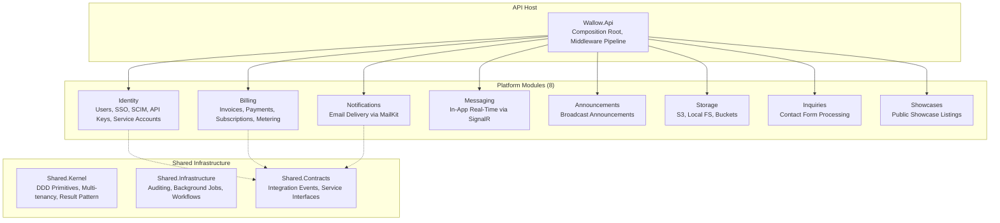
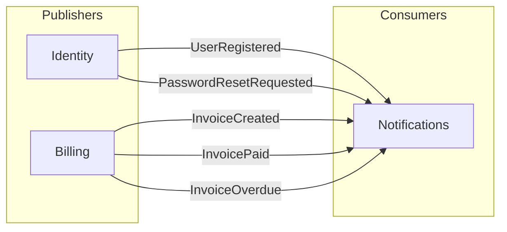
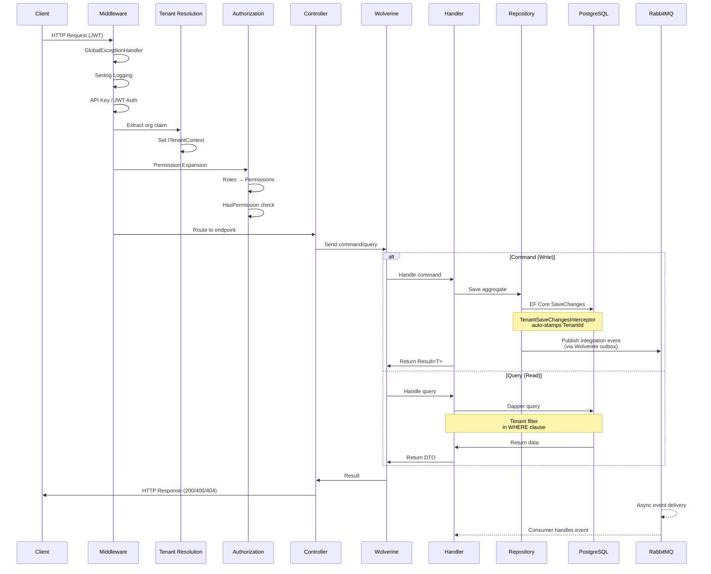
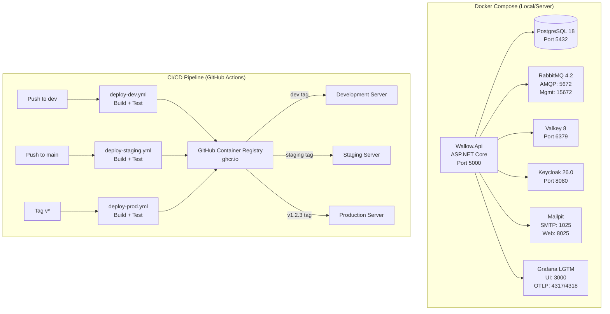
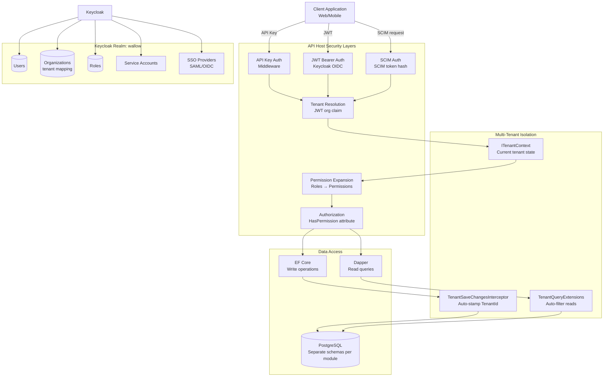

# Wallow Architecture Diagrams

> Visual architecture documentation for the Wallow modular monolith platform

**Date:** 2026-02-28
**System:** Wallow Platform - 8 Modules + Shared Infrastructure
**Technology:** .NET 10, PostgreSQL, RabbitMQ, Wolverine, Keycloak, Hangfire, Elsa 3

---

## Table of Contents

1. [System Overview](#1-system-overview)
2. [Module Interaction & Event Flow](#2-module-interaction--event-flow)
3. [Request Data Flow](#3-request-data-flow)
4. [Deployment Architecture](#4-deployment-architecture)
5. [Security Boundaries](#5-security-boundaries)
6. [Module Dependency Graph](#6-module-dependency-graph)

---

## 1. System Overview

High-level view of all 8 modules and shared infrastructure.



---

## 2. Module Interaction & Event Flow

Integration events flowing between modules via RabbitMQ (Wolverine).



**Key Points:**
- Modules communicate only via integration events through Shared.Contracts
- Notifications subscribes to events from other modules and delivers through appropriate channels
- Modules never call Notifications directly

---

## 3. Request Data Flow

How a typical HTTP request flows through the system.



**Key Points:**
- **Tenant Resolution**: JWT `org` claim → ITenantContext
- **Authorization**: Role-based → Permission expansion → HasPermission attribute
- **CQRS**: Commands use EF Core + outbox, Queries use Dapper
- **Multi-tenancy**: Automatic via interceptor (writes) and query filters (reads)

---

## 4. Deployment Architecture

Docker Compose services, CI/CD pipeline, and environment promotion.



**CI/CD Flow:**
- **Dev**: Push to `dev` → deploy-dev.yml → ghcr.io:dev → Dev server
- **Staging**: Push to `main` → deploy-staging.yml → ghcr.io:staging → Staging server
- **Production**: Tag `v*` → deploy-prod.yml → ghcr.io:v1.2.3 → Prod server

---

## 5. Security Boundaries

Authentication, authorization, and multi-tenant isolation layers.



**Security Layers:**
1. **Authentication**: API Key OR JWT OR SCIM token
2. **Tenant Resolution**: Extract `org` claim from JWT → ITenantContext
3. **Permission Expansion**: Roles → Permissions via RolePermissionMapping
4. **Authorization**: `[HasPermission("InvoicesRead")]` attribute
5. **Data Isolation**:
   - **Writes**: TenantSaveChangesInterceptor auto-stamps TenantId
   - **Reads**: Query filters auto-add `WHERE TenantId = @current`

---

## 6. Module Dependency Graph

Shows module dependencies on shared infrastructure and cross-module service interfaces.

```mermaid
graph TB
    subgraph "8 Modules"
        M1[Identity]
        M2[Billing]
        M3[Notifications]
        M4[Messaging]
        M5[Announcements]
        M6[Storage]
        M7[Inquiries]
        M8[Showcases]
    end

    subgraph "Shared Infrastructure"
        SK[Shared.Kernel<br/>Entity, AggregateRoot<br/>ITenantScoped<br/>Result&lt;T&gt;<br/>TenantId]

        SI[Shared.Infrastructure<br/>Auditing (Audit.NET)<br/>Background Jobs (Hangfire)<br/>Workflows (Elsa 3)]

        SC[Shared.Contracts<br/>Integration Events<br/>Service Interfaces]
    end

    M1 --> SK
    M2 --> SK
    M3 --> SK
    M4 --> SK
    M5 --> SK
    M6 --> SK
    M7 --> SK
    M8 --> SK

    M1 -.->|publishes events| SC
    M2 -.->|publishes events| SC
    M3 -.->|consumes events| SC

    subgraph "Cross-Module Service Interfaces"
        IUserQuery[IUserQueryService]
        IInvoiceQuery[IInvoiceQueryService]
        IMeteringQuery[IMeteringQueryService]
    end

    SC -.-> IUserQuery
    SC -.-> IInvoiceQuery
    SC -.-> IMeteringQuery

    M1 -->|implements| IUserQuery
    M2 -->|implements| IInvoiceQuery
    M2 -->|implements| IMeteringQuery

    subgraph "External Dependencies"
        Keycloak[Keycloak<br/>Identity Provider]
        MailKit[MailKit<br/>SMTP]
        S3[S3-compatible<br/>Storage]
        Elsa[Elsa Workflows<br/>Engine]
    end

    M1 --> Keycloak
    M3 --> MailKit
    M6 --> S3
    SI --> Elsa
```

**Dependency Rules:**
- Modules depend on **Shared.Kernel** for DDD primitives, multi-tenancy
- Modules depend on **Shared.Contracts** for integration events only (zero external deps)
- **Shared.Infrastructure** provides cross-cutting: Auditing, Background Jobs, Workflows
- No direct module-to-module references (enforced by project structure)

---

## Module Quick Reference

| Module | Architecture | Key Features | Status |
|--------|-------------|-------------|--------|
| **Identity** | EF Core | Keycloak integration, API keys, service accounts, SSO, SCIM, RBAC | Production |
| **Billing** | EF Core | Invoices, payments, subscriptions, metered usage tracking | Production |
| **Notifications** | EF Core | Email delivery via MailKit, SMTP configuration | Production |
| **Messaging** | EF Core | In-app real-time messages via SignalR | Production |
| **Announcements** | EF Core | Broadcast announcements with targeting rules | Production |
| **Storage** | EF Core | S3/Local FS, buckets, presigned URLs | Production |
| **Inquiries** | EF Core | Contact form processing and routing | Production |
| **Showcases** | EF Core | Public-facing showcase listings | Production |

---

## References

- **Design Docs**: `docs/plans/*.md`
- **Developer Guide**: `docs/DEVELOPER_GUIDE.md`
- **Deployment Guide**: `docs/DEPLOYMENT_GUIDE.md`
