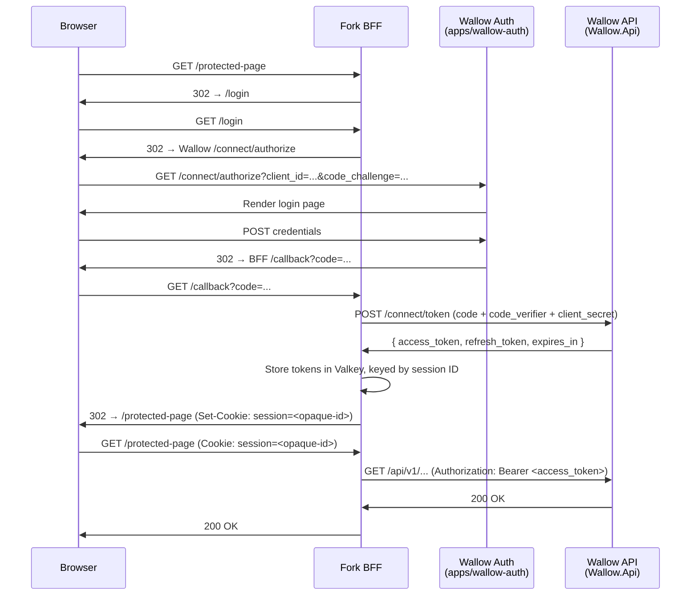

# BFF Pattern Integration Guide

This guide explains how fork sites can consume Wallow as an identity provider using the Backend-for-Frontend (BFF) pattern with the OAuth 2.0 Authorization Code flow.

## Overview

When a fork site builds its own frontend — whether a separate Next.js app, a mobile-companion web app, or any other user-facing property — it needs a secure way to authenticate its users against Wallow. The BFF pattern is the recommended approach.

A BFF (Backend-for-Frontend) is a thin server-side layer that sits between the browser and upstream services. Its two jobs are:

1. Handle the OAuth Authorization Code exchange so that access tokens never reach the browser.
2. Proxy authenticated API calls from the browser using those server-held tokens, attaching the `Authorization` header transparently.

The browser holds only an opaque session cookie. The access token, refresh token, and any sensitive credentials live exclusively on the BFF server, stored in Valkey (or Redis).

### Why Not Use PKCE Directly in the Browser?

Single-page applications can use PKCE with the Authorization Code flow, but this still results in the access token sitting in browser memory where it is exposed to cross-site scripting attacks. The BFF pattern eliminates that exposure entirely: the browser never sees a token at any point in the session lifecycle.

---

## Architecture



---

## Prerequisites

### 1. Register an OAuth Application in Wallow

Sign in to the Wallow dashboard and navigate to **Settings > Applications > Register Application** (`/dashboard/apps/register`). Fill in:

| Field | Value |
|-------|-------|
| Application name | Must start with the `app-` prefix (e.g., `app-my-fork-site`). Also shown on the consent screen. |
| Client type | **Select `Confidential`.** The form defaults to `Public`, but a BFF integration requires a confidential client so it can authenticate to the token endpoint with a `client_secret`. A public client is issued no secret and cannot complete the token exchange below. |
| Grant type | `authorization_code` |
| Redirect URIs | The full callback URL on your BFF (e.g., `https://myapp.example.com/callback`). Each URI must be absolute HTTPS; `localhost` may use plain HTTP for local development. |
| Post-logout redirect URIs | Where to send the user after logout (e.g., `https://myapp.example.com/`). Same absolute-HTTPS (localhost-HTTP) rule. |
| Scopes | The scopes your application needs. `openid`, `profile`, `email`, and `offline_access` are always available for login; you may additionally request any developer-app scope your integration uses. |

With `Confidential` selected, Wallow registers a **confidential client** and returns a `client_id` together with a `client_secret`. **The secret is shown exactly once, at creation time** — copy it straight into your BFF's server-side configuration (`OIDC_CLIENT_SECRET`). If you lose it, rotate the secret from the application's settings to mint a new one; the previous secret stops working immediately.

Because the client is confidential, your BFF authenticates to the token endpoint with its `client_secret` **in addition to** PKCE. Keep the secret in the BFF server process (or a secrets manager) only — never in the browser or in source control.

### 2. Decide Where Your BFF Runs

The BFF must be a server-side process (Node.js, ASP.NET Core, or similar). It cannot be a pure static frontend. The BFF needs:

- Outbound HTTPS access to the Wallow API endpoint
- A Valkey/Redis instance (or in-process memory for single-instance development) for session storage
- A secret for signing/encrypting the session cookie

---

## Authorization Code Flow

### Step 1 — Initiate Login

When the user navigates to a protected route, the BFF redirects them to the Wallow authorization endpoint. Before redirecting, the BFF generates and stores a PKCE `code_verifier` (a cryptographically random string) and derives the `code_challenge` from it.

```
GET {WALLOW_AUTH_URL}/connect/authorize
  ?client_id=app-my-fork-site
  &response_type=code
  &redirect_uri=https://myapp.example.com/callback
  &scope=openid+profile+email+offline_access
  &state={random-csrf-token}
  &code_challenge={base64url(sha256(code_verifier))}
  &code_challenge_method=S256
```

Store both `state` and `code_verifier` in the user's pre-authentication session so they can be validated in step 3.

`WALLOW_AUTH_URL` is the base URL of the auth app (`apps/wallow-auth`, e.g., `https://wallow.example.com/auth` when behind a reverse proxy).

### Step 2 — User Authenticates on Wallow

The auth app presents the login page. If the user has not previously authorized your application, Wallow also displays a consent screen listing the requested scopes. The user approves or denies access.

### Step 3 — Handle the Callback

Wallow redirects the browser back to your BFF callback with an authorization code:

```
GET https://myapp.example.com/callback?code={auth_code}&state={state}
```

Your BFF must:

1. Validate that `state` matches the value stored in step 1 (CSRF protection).
2. Exchange the code for tokens by calling the Wallow token endpoint.

### Step 4 — Exchange the Code for Tokens

```
POST {WALLOW_API_URL}/connect/token
Content-Type: application/x-www-form-urlencoded

grant_type=authorization_code
&code={auth_code}
&redirect_uri=https://myapp.example.com/callback
&client_id=app-my-fork-site
&client_secret={client_secret}
&code_verifier={code_verifier_from_step_1}
```

`WALLOW_API_URL` is the base URL of the `Wallow.Api` app (e.g., `https://wallow.example.com/api`).
Send the `client_secret` from the server-side environment only; the confidential client authenticates with it alongside the PKCE `code_verifier`.

Wallow responds with:

```json
{
  "access_token": "eyJ...",
  "refresh_token": "eyJ...",
  "token_type": "Bearer",
  "expires_in": 3600,
  "id_token": "eyJ..."
}
```

### Step 5 — Store Tokens and Issue Session Cookie

The BFF stores the token set in Valkey under a random session ID, then issues an opaque session cookie to the browser:

```
Set-Cookie: session=<random-session-id>; HttpOnly; Secure; SameSite=Strict; Path=/
```

The browser only ever holds this opaque identifier — never a token.

### Step 6 — Fetch the User Profile (Optional)

After the token exchange, the BFF can retrieve the authenticated user's claims from the Wallow userinfo endpoint:

```
GET {WALLOW_API_URL}/connect/userinfo
Authorization: Bearer {access_token}
```

Response:

```json
{
  "sub": "user-guid",
  "email": "user@example.com",
  "given_name": "Jane",
  "family_name": "Smith",
  "name": "Jane Smith"
}
```

Store the relevant claims in the session alongside the tokens to avoid repeated userinfo calls.

---

## Session Management

The BFF session entry in Valkey stores:

```json
{
  "access_token": "eyJ...",
  "refresh_token": "eyJ...",
  "expires_at": "2026-03-31T15:00:00Z",
  "user": {
    "sub": "user-guid",
    "email": "user@example.com",
    "name": "Jane Smith"
  }
}
```

Set the Valkey key TTL to match your desired session lifetime (typically 8–24 hours). When the session key expires, the user is treated as unauthenticated and must log in again.

### Proxying API Calls

All browser requests to your BFF that require API data go through the following pattern:

1. Read the session cookie from the incoming request.
2. Look up the session in Valkey.
3. If the session is missing or expired, redirect to login.
4. If the access token is expired, refresh it (see below).
5. Forward the API call with `Authorization: Bearer {access_token}`.
6. Return the response to the browser.

---

## Token Refresh

Access tokens issued by Wallow expire (typically after 1 hour). Before forwarding an API call, the BFF checks whether `expires_at` is within a short window (e.g., 60 seconds) and proactively refreshes.

```
POST {WALLOW_API_URL}/connect/token
Content-Type: application/x-www-form-urlencoded

grant_type=refresh_token
&refresh_token={refresh_token}
&client_id=app-my-fork-site
&client_secret={client_secret}
```

On success, Wallow returns a new `access_token` and a rotated `refresh_token`. Update the session record in Valkey with the new values and the new `expires_at`.

If the refresh fails (e.g., the refresh token has been revoked), clear the session and redirect the user to login.

---

## Logout

### BFF-Initiated Logout

1. Read the session cookie and look up the session.
2. Retrieve the `id_token` from the session (if stored — recommended for OIDC logout hint).
3. Clear the session from Valkey.
4. Delete the session cookie (set `Max-Age=0`).
5. Redirect the browser to the Wallow logout endpoint:

```
GET {WALLOW_API_URL}/connect/logout
  ?post_logout_redirect_uri=https://myapp.example.com/
  &id_token_hint={id_token}
```

Wallow terminates the user's Wallow session and redirects the browser to `post_logout_redirect_uri`.

> **Tip:** Store the `id_token` alongside the access and refresh tokens in the session so you can provide the `id_token_hint`. Without it, Wallow may show an intermediate confirmation page before completing logout.

---

## Security Notes

### Tokens Never Reach the Browser

The entire value of the BFF pattern is that tokens are handled exclusively server-side. Never return `access_token` or `refresh_token` in an API response to the browser.

### Confidential Client + PKCE

Applications registered through the dashboard are **confidential** clients: the BFF authenticates to the token endpoint with its `client_secret` **and** uses PKCE (`code_challenge_method=S256`). Attempts to exchange a code without a valid `code_verifier`, or without the matching `client_secret`, fail with a 400 error. The `client_secret` is shown once at registration — store it server-side only and rotate it if it is ever exposed.

### Session Cookie Flags

Always issue session cookies with:

| Flag | Value | Reason |
|------|-------|--------|
| `HttpOnly` | true | Prevents JavaScript from reading the cookie |
| `Secure` | true | Only transmitted over HTTPS |
| `SameSite` | `Strict` | Blocks the cookie from being sent in cross-site requests, mitigating CSRF |
| `Path` | `/` | Scoped to the entire BFF origin |

### State Parameter

Always validate that the `state` returned in the callback matches what you sent. This is your primary CSRF defense for the authorization flow itself.

### Valkey Key Management

Use a dedicated Valkey database or key namespace for BFF sessions. Set appropriate TTLs so session data is not retained indefinitely. Rotate your Valkey credentials and connection strings as part of standard operational hygiene.

---

## Building a TypeScript BFF? Don't hand-roll this part

Everything above is the wire protocol, useful for any language or framework.
If your BFF is TypeScript, [`@bc-solutions-coder/sdk`](typescript-sdk.md)
already implements two pieces of it that are easy to get subtly wrong by hand:

- **CSRF token wiring.** The SDK's `csrf` module (`setCsrfToken`,
  `wireCsrfInterceptor`, `isSafeMethod`) is the client-side half of the
  synchronizer-token gate — it stamps the current token onto every
  state-changing request and leaves safe methods alone. See
  [CSRF protection](typescript-sdk.md#csrf-protection).
- **SSR cookie forwarding.** If your BFF also server-renders authenticated
  routes, an SSR-time request runs on Node, which has no cookie jar and
  cannot resolve a relative URL — it needs the incoming request's absolute
  origin and session cookie forwarded explicitly, per request. The SDK's
  `ssr` seam (`setSsrRequestContextResolver`, `configureSsrClient`,
  `wireSsrCookieInterceptor`) resolves both without leaking a `node:` import
  into the browser bundle. `apps/wallow-web/src/ssr.tsx` is the reference
  consumer: it owns the `AsyncLocalStorage` that scopes each incoming
  request and registers it with the SDK once, at module scope. See
  [SSR request context for server-rendered loaders](typescript-sdk.md#ssr-request-context-for-server-rendered-loaders).

Reach for these instead of reimplementing the interceptor and cookie-jar
plumbing shown in the [Example Implementations](#example-implementations)
below — they exist specifically so a TypeScript BFF does not have to
reinvent this glue.

---

## Example Implementations

### Node.js / Express BFF

```javascript
import express from "express";
import crypto from "crypto";
import { createClient } from "redis";
import cookieParser from "cookie-parser";

const app = express();
app.use(cookieParser());

const redis = createClient({ url: process.env.VALKEY_URL });
await redis.connect();

const WALLOW_API_URL = process.env.WALLOW_API_URL; // e.g. https://wallow.example.com/api
const WALLOW_AUTH_URL = process.env.WALLOW_AUTH_URL; // e.g. https://wallow.example.com/auth
const CLIENT_ID = process.env.CLIENT_ID; // e.g. app-my-fork-site
const CLIENT_SECRET = process.env.CLIENT_SECRET; // confidential secret, shown once at registration
const REDIRECT_URI = process.env.REDIRECT_URI; // e.g. https://myapp.example.com/callback
const SESSION_COOKIE = "session";

// --- Middleware: require authenticated session ---
async function requireAuth(req, res, next) {
  const sessionId = req.cookies[SESSION_COOKIE];
  if (!sessionId) return res.redirect("/login");

  const raw = await redis.get(`session:${sessionId}`);
  if (!raw) return res.redirect("/login");

  const session = JSON.parse(raw);

  // Refresh access token if it expires within 60 seconds
  if (new Date(session.expires_at) < new Date(Date.now() + 60_000)) {
    const refreshed = await refreshTokens(session.refresh_token);
    if (!refreshed) {
      await redis.del(`session:${sessionId}`);
      return res.redirect("/login");
    }
    session.access_token = refreshed.access_token;
    session.refresh_token = refreshed.refresh_token;
    session.expires_at = new Date(Date.now() + refreshed.expires_in * 1000).toISOString();
    await redis.set(`session:${sessionId}`, JSON.stringify(session), { KEEPTTL: true });
  }

  req.session = session;
  next();
}

// --- Login: generate PKCE and redirect to Wallow ---
app.get("/login", (req, res) => {
  const codeVerifier = crypto.randomBytes(64).toString("base64url");
  const codeChallenge = crypto
    .createHash("sha256")
    .update(codeVerifier)
    .digest("base64url");
  const state = crypto.randomBytes(32).toString("hex");

  // Store verifier + state in a short-lived pre-auth cookie
  res.cookie("pkce_verifier", codeVerifier, { httpOnly: true, secure: true, maxAge: 300_000 });
  res.cookie("oauth_state", state, { httpOnly: true, secure: true, maxAge: 300_000 });

  const params = new URLSearchParams({
    client_id: CLIENT_ID,
    response_type: "code",
    redirect_uri: REDIRECT_URI,
    scope: "openid profile email offline_access",
    state,
    code_challenge: codeChallenge,
    code_challenge_method: "S256",
  });

  res.redirect(`${WALLOW_AUTH_URL}/connect/authorize?${params}`);
});

// --- Callback: exchange code for tokens ---
app.get("/callback", async (req, res) => {
  const { code, state } = req.query;

  if (state !== req.cookies.oauth_state) {
    return res.status(400).send("Invalid state parameter");
  }

  const codeVerifier = req.cookies.pkce_verifier;

  const tokenResponse = await fetch(`${WALLOW_API_URL}/connect/token`, {
    method: "POST",
    headers: { "Content-Type": "application/x-www-form-urlencoded" },
    body: new URLSearchParams({
      grant_type: "authorization_code",
      code,
      redirect_uri: REDIRECT_URI,
      client_id: CLIENT_ID,
      client_secret: CLIENT_SECRET,
      code_verifier: codeVerifier,
    }),
  });

  if (!tokenResponse.ok) {
    return res.status(400).send("Token exchange failed");
  }

  const tokens = await tokenResponse.json();

  const sessionId = crypto.randomBytes(32).toString("hex");
  const session = {
    access_token: tokens.access_token,
    refresh_token: tokens.refresh_token,
    id_token: tokens.id_token,
    expires_at: new Date(Date.now() + tokens.expires_in * 1000).toISOString(),
  };

  await redis.set(`session:${sessionId}`, JSON.stringify(session), { EX: 86400 });

  res.clearCookie("pkce_verifier");
  res.clearCookie("oauth_state");
  res.cookie(SESSION_COOKIE, sessionId, {
    httpOnly: true,
    secure: true,
    sameSite: "strict",
    path: "/",
  });
  res.redirect("/");
});

// --- Protected route example ---
app.get("/api/me", requireAuth, async (req, res) => {
  const upstream = await fetch(`${WALLOW_API_URL}/connect/userinfo`, {
    headers: { Authorization: `Bearer ${req.session.access_token}` },
  });
  const data = await upstream.json();
  res.json(data);
});

// --- Logout ---
app.get("/logout", async (req, res) => {
  const sessionId = req.cookies[SESSION_COOKIE];
  if (sessionId) {
    const raw = await redis.get(`session:${sessionId}`);
    const idTokenHint = raw ? JSON.parse(raw).id_token : undefined;
    await redis.del(`session:${sessionId}`);
    res.clearCookie(SESSION_COOKIE);

    const params = new URLSearchParams({
      post_logout_redirect_uri: "https://myapp.example.com/",
      ...(idTokenHint && { id_token_hint: idTokenHint }),
    });
    return res.redirect(`${WALLOW_API_URL}/connect/logout?${params}`);
  }
  res.redirect("/");
});

async function refreshTokens(refreshToken) {
  const response = await fetch(`${WALLOW_API_URL}/connect/token`, {
    method: "POST",
    headers: { "Content-Type": "application/x-www-form-urlencoded" },
    body: new URLSearchParams({
      grant_type: "refresh_token",
      refresh_token: refreshToken,
      client_id: CLIENT_ID,
      client_secret: CLIENT_SECRET,
    }),
  });
  if (!response.ok) return null;
  return response.json();
}

app.listen(3000);
```

### ASP.NET Core BFF

```csharp
// Program.cs — ASP.NET Core BFF skeleton

WebApplicationBuilder builder = WebApplication.CreateBuilder(args);

builder.Services.AddAuthentication(options =>
    {
        options.DefaultScheme = CookieAuthenticationDefaults.AuthenticationScheme;
        options.DefaultChallengeScheme = OpenIdConnectDefaults.AuthenticationScheme;
    })
    .AddCookie(options =>
    {
        options.Cookie.HttpOnly = true;
        options.Cookie.SecurePolicy = CookieSecurePolicy.Always;
        options.Cookie.SameSite = SameSiteMode.Strict;
        options.SlidingExpiration = true;
        options.ExpireTimeSpan = TimeSpan.FromHours(8);
    })
    .AddOpenIdConnect(options =>
    {
        options.Authority = builder.Configuration["Wallow:ApiBaseUrl"]; // e.g. https://wallow.example.com/api
        options.ClientId = builder.Configuration["Wallow:ClientId"];        // e.g. app-my-fork-site
        options.ClientSecret = builder.Configuration["Wallow:ClientSecret"]; // confidential secret, shown once at registration
        options.ResponseType = "code";
        options.UsePkce = true;
        options.SaveTokens = true; // Stores tokens in the encrypted cookie or session
        options.Scope.Add("openid");
        options.Scope.Add("profile");
        options.Scope.Add("email");
        options.Scope.Add("offline_access");
        options.CallbackPath = "/callback";
        options.SignedOutCallbackPath = "/signout-callback";
    });

// Use server-side session storage instead of encrypting tokens in the cookie
builder.Services.AddStackExchangeRedisCache(options =>
{
    options.Configuration = builder.Configuration["Valkey:ConnectionString"];
});
builder.Services.AddSession(options =>
{
    options.Cookie.HttpOnly = true;
    options.Cookie.IsEssential = true;
    options.IdleTimeout = TimeSpan.FromHours(8);
});

builder.Services.AddReverseProxy()
    .LoadFromConfig(builder.Configuration.GetSection("ReverseProxy"));

WebApplication app = builder.Build();

app.UseAuthentication();
app.UseAuthorization();
app.UseSession();

// Authenticated proxy routes — YARP forwards with the access token injected
app.MapReverseProxy(pipeline =>
{
    pipeline.Use(async (context, next) =>
    {
        string? accessToken = await context.GetTokenAsync("access_token");
        if (!string.IsNullOrEmpty(accessToken))
        {
            context.Request.Headers.Authorization = $"Bearer {accessToken}";
        }
        await next();
    });
});

app.MapGet("/bff/logout", async (HttpContext context) =>
{
    await context.SignOutAsync(CookieAuthenticationDefaults.AuthenticationScheme);
    await context.SignOutAsync(OpenIdConnectDefaults.AuthenticationScheme);
}).RequireAuthorization();

app.Run();
```

Add the corresponding `appsettings.json` configuration:

```json
{
  "Wallow": {
    "ApiBaseUrl": "https://wallow.example.com/api",
    "ClientId": "app-my-fork-site",
    "ClientSecret": "set-from-environment-or-a-secrets-manager"
  },
  "Valkey": {
    "ConnectionString": "localhost:6379"
  },
  "ReverseProxy": {
    "Routes": {
      "wallow-api": {
        "ClusterId": "wallow",
        "AuthorizationPolicy": "Default",
        "Match": {
          "Path": "/api/{**catch-all}"
        }
      }
    },
    "Clusters": {
      "wallow": {
        "Destinations": {
          "primary": {
            "Address": "https://wallow.example.com/api"
          }
        }
      }
    }
  }
}
```

---

## Endpoint Reference

| Endpoint | Method | Description |
|----------|--------|-------------|
| `/connect/authorize` | GET | Start the Authorization Code flow (served by Wallow.Api; fronted same-origin by the `apps/wallow-auth` proxy) |
| `/connect/token` | POST | Exchange code for tokens; refresh tokens (served by Wallow.Api) |
| `/connect/userinfo` | GET | Retrieve claims for the authenticated user (served by Wallow.Api) |
| `/connect/logout` | GET | End the Wallow session and redirect (served by Wallow.Api) |

All `/connect/*` endpoints are served by the OpenIddict middleware. When Wallow is deployed behind a reverse proxy with path-based routing, the Auth app (`/connect/authorize`) and the API (`/connect/token`, `/connect/userinfo`, `/connect/logout`) are on separate origins — use the correct base URL for each.

---

## Troubleshooting

| Symptom | Likely Cause | Fix |
|---------|--------------|-----|
| `invalid_client` on token exchange | `client_id` mismatch or missing `app-` prefix | Confirm the client ID matches exactly what was registered |
| `invalid_grant` on token exchange | `code_verifier` mismatch or code already used | Generate a fresh `code_verifier` per login attempt; codes are single-use |
| `invalid_grant` on token refresh | Refresh token revoked or expired | Clear the session and redirect the user to login |
| Consent screen appears on every login | Application not granted `offline_access` or user previously denied | Ensure `offline_access` is in the requested scopes and the user approves |
| Session cookie not sent to BFF | `SameSite=Strict` blocking cross-site redirect | The BFF and the callback URL must be on the same origin as your frontend |
| Redirect URI mismatch | Registered URI does not exactly match `redirect_uri` in the request | Update the registered redirect URI in the Wallow dashboard to match |
