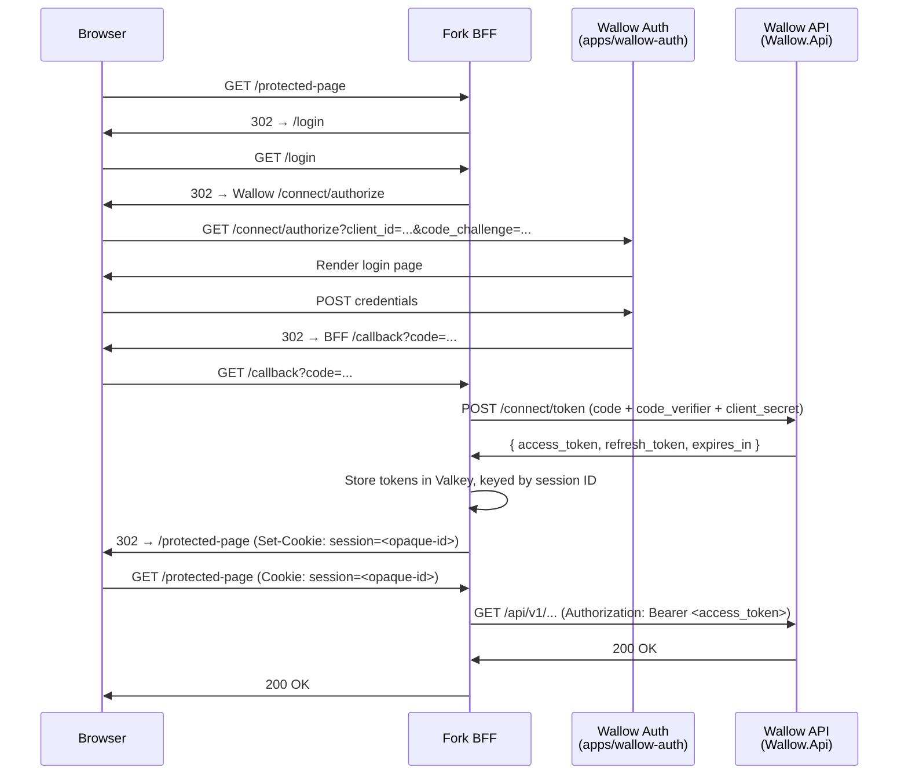

# BFF Pattern Integration Guide

This guide explains how fork sites can consume Wallow as an identity provider using the Backend-for-Frontend (BFF) pattern with the OAuth 2.0 Authorization Code flow.

## Overview

When a fork site builds its own frontend — whether a separate Next.js app, a mobile-companion web app, or any other user-facing property — it needs a secure way to authenticate its users against Wallow. The BFF pattern is the recommended approach.

A BFF (Backend-for-Frontend) is a thin server-side layer that sits between the browser and upstream services. Its two jobs are:

1. Handle the OAuth Authorization Code exchange so that access tokens never reach the browser.
2. Proxy authenticated API calls from the browser using those server-held tokens, attaching the `Authorization` header transparently.

The browser holds only an opaque session cookie. The access token, refresh token, and any sensitive credentials live exclusively on the BFF server, stored in Valkey (or Redis).

### Why Not Use PKCE Directly in the Browser?

Single-page applications can use PKCE with the Authorization Code flow, but this still results in the access token sitting in browser memory where it is exposed to cross-site scripting attacks. The BFF pattern eliminates that exposure entirely: the browser never sees a token at any point in the session lifecycle.

---

## Architecture


```mermaid
sequenceDiagram
    participant Browser
    participant BFF as Fork BFF
    participant Auth as Wallow Auth<br/>(apps/wallow-auth)
    participant API as Wallow API<br/>(Wallow.Api)

    Browser->>BFF: GET /protected-page
    BFF->>Browser: 302 → /login
    Browser->>BFF: GET /login
    BFF->>Browser: 302 → Wallow /connect/authorize
    Browser->>Auth: GET /connect/authorize?client_id=...&code_challenge=...
    Auth->>Browser: Render login page
    Browser->>Auth: POST credentials
    Auth->>Browser: 302 → BFF /callback?code=...
    Browser->>BFF: GET /callback?code=...
    BFF->>API: POST /connect/token (code + code_verifier + client_secret)
    API->>BFF: { access_token, refresh_token, expires_in }
    BFF->>BFF: Store tokens in Valkey, keyed by session ID
    BFF->>Browser: 302 → /protected-page (Set-Cookie: session=<opaque-id>)
    Browser->>BFF: GET /protected-page (Cookie: session=<opaque-id>)
    BFF->>API: GET /api/v1/... (Authorization: Bearer <access_token>)
    API->>BFF: 200 OK
    BFF->>Browser: 200 OK
```

---

## Prerequisites

### 1. Register an OAuth Application in Wallow

Sign in to the Wallow dashboard as an admin or manager of your organization, open
**Organizations → your organization**, and press **Register application** in the
**Applications** ledger. The inline stepper walks three steps — only the required fields
gate the **Register** button, which is reachable from every step:

| Step      | Field                     | Value                                                                                                                                                                                                                                    |
| --------- | ------------------------- | ---------------------------------------------------------------------------------------------------------------------------------------------------------------------------------------------------------------------------------------- |
| Basics    | Name                      | Required. Shown on the consent screen, and the source of the client id, which Wallow derives as `app-<organization-slug>-<name-slug>`. Both are immutable after registration.                                                             |
| Redirects | Redirect URIs             | Required, one per line. The full callback URL on your BFF (e.g., `https://myapp.example.com/callback`). Each URI must be absolute, fragment-free, and HTTPS; `http://localhost` (and `127.0.0.1`) may use plain HTTP for local development. |
| Redirects | Post-logout redirect URIs | Optional. Where to send the user after logout (e.g., `https://myapp.example.com/`). Same URI rules.                                                                                                                                       |
| Redirects | Back-channel logout URI   | Optional. Same URI rules.                                                                                                                                                                                                                 |
| Scopes    | Scopes                    | At least one. `openid`, `profile`, `email`, and `offline_access` are the login scopes (`openid` is pre-selected); below them is the organization-grantable API scope catalog. Platform-only scopes are listed but cannot be granted.       |

Every application is a **confidential client** — there is no public-client option — so
Wallow returns a `client_id` together with a `client_secret`. **The secret is shown exactly
once, on the reveal that follows Register**, alongside a ready-made `.env` block
(`OIDC_ISSUER`, `OIDC_CLIENT_ID`, `OIDC_CLIENT_SECRET`, `OIDC_REDIRECT_URI`,
`OIDC_POST_LOGOUT_REDIRECT_URI`, `OIDC_SCOPES`, `BFF_API_BASE_URL`, and a freshly generated
`COOKIE_PASSWORD`) and an **Open quickstart** link back to this guide. Copy the block straight
into your BFF's server-side configuration; the secret cannot be fetched again.

Because the client is confidential, your BFF authenticates to the token endpoint with its `client_secret` **in addition to** PKCE. Keep the secret in the BFF server process (or a secrets manager) only — never in the browser or in source control.

### 2. Decide Where Your BFF Runs

The BFF must be a server-side process (Node.js, ASP.NET Core, or similar). It cannot be a pure static frontend. The BFF needs:

- Outbound HTTPS access to the Wallow API endpoint
- A Valkey/Redis instance (or in-process memory for single-instance development) for session storage
- A secret for signing/encrypting the session cookie

---

## The Issuer and Origin Contract

A BFF configuration names **three different URLs for the same Wallow deployment**, and they are
not interchangeable. Getting the split wrong is the most common way a fork builds, boots, and
then fails at login.

| Setting             | Who resolves it    | What it must be                                                                                                                                                                                                                                                                                                  |
| ------------------- | ------------------ | ------------------------------------------------------------------------------------------------------------------------------------------------------------------------------------------------------------------------------------------------------------------------------------------------------------------ |
| `OIDC_ISSUER`       | The **browser**    | The public origin the browser is redirected to for `/connect/authorize` and `/connect/logout`. It must match the issuer the API advertises, character for character, path prefix included.                                                                                                                        |
| `OIDC_METADATA_URL` | The **BFF server** | Where the server fetches the discovery document. Defaults to `${OIDC_ISSUER}/.well-known/openid-configuration`. Set it explicitly whenever the server reaches the API under a different name than the browser does — a container network, split-horizon DNS, or to avoid hairpinning back out through the ingress. |
| `BFF_API_BASE_URL`  | The **BFF server** | The upstream the `/api` proxy forwards to. In every deployed topology this is a container-internal address, never the public one.                                                                                                                                                                                 |

Those are the SDK's concrete variable names. In the hand-rolled walkthrough below they appear as
`WALLOW_AUTH_URL` (the browser-facing origin the user is redirected to) and `WALLOW_API_URL` (the
backchannel base for token and userinfo calls). The distinction that matters is not the naming, it
is **which side of the connection resolves the URL** — a browser-facing origin and a
server-reachable one are frequently not the same string.

The server uses the discovery document's `token_endpoint` and `userinfo_endpoint` verbatim —
those are backchannel calls that never leave the server. It **re-bases** the browser-facing
`authorization_endpoint` and `end_session_endpoint` onto `OIDC_ISSUER`, preserving the issuer's
path prefix. That re-basing is what lets the browser and the server reach one OP under two
different names.

### The issuer differs per environment

Wallow's own three environments each answer "what is the issuer" differently, and none of them is
wrong. A fork inherits this shape, so it is worth knowing which one you are copying:

| Environment                                          | `OIDC_ISSUER` (browser-facing)                     | `OIDC_METADATA_URL` (server-reachable)                          | Why it is what it is                                                                                                                                                                                                                                     |
| ---------------------------------------------------- | -------------------------------------------------- | --------------------------------------------------------------- | ---------------------------------------------------------------------------------------------------------------------------------------------------------------------------------------------------------------------------------------------------------- |
| **Local Aspire dev** (`pnpm backend`)                | `http://localhost:3002` — the **auth app's** origin | `http://localhost:5001/.well-known/openid-configuration`         | In development the API advertises the auth app as its issuer (`AuthUrl` in `appsettings.Development.json`), because the auth app same-origin-proxies `/connect/*` and `/.well-known/*` through to the API. Discovery goes straight to the API to save a proxy hop. |
| **Containerised E2E** (`docker/docker-compose.test.yml`) | `http://localhost:5050` — the **API's** origin (classic default; `./scripts/e2e.sh` substitutes a per-run port, Wallow-joo0) | `http://host.docker.internal:5050/.well-known/openid-configuration` | That stack pins `OpenIddict__Issuer` to the API's published port, so the issuer is the API itself rather than the auth app. Inside the BFF container `localhost` is the container, not the host, so discovery has to go through `host.docker.internal` instead.                    |
| **Production compose** (path-based, the default)     | `https://wallow.dev/auth` — the **auth app's** public URL **with its path prefix** | `http://wallow-api:8080/.well-known/openid-configuration`         | As in development the auth app same-origin-proxies `/connect/*` and `/.well-known/*`, and everything sits behind one ingress hostname, so the issuer carries the `/auth` prefix. Discovery travels over the container network, which is why it needs no TLS and no path prefix. |

Two things follow from that table:

- **The issuer is not always the same service.** The API decides what it advertises: an explicit
  `OpenIddict:Issuer` (env-var form `OpenIddict__Issuer`) wins, otherwise it falls back to
  `AuthUrl`. Whatever the API ends up advertising, the BFF's `OIDC_ISSUER` must equal it.
- **The issuer may carry a path.** In the path-based production topology it is
  `https://wallow.dev/auth`, not `https://wallow.dev`. Every browser-facing endpoint is re-based
  onto that prefix, so a fork that drops the path silently sends users to `/connect/authorize` on
  the web app's origin, where nothing serves it.

### What breaks when one origin moves

These URLs are a coupled set. Changing one without the others produces failures that look
unrelated to the change:

| You changed                                                                 | What actually breaks                                                                                                                    | How it shows up                                                                                                                       |
| --------------------------------------------------------------------------- | ---------------------------------------------------------------------------------------------------------------------------------------- | -------------------------------------------------------------------------------------------------------------------------------------- |
| The auth app's host or port, but not the API's `AuthUrl` / `OpenIddict__Issuer` | The API keeps advertising — and keeps minting `iss` claims for — the old origin, so no value of `OIDC_ISSUER` is correct.              | Point the BFF at the new origin and the callback rejects the `id_token`, whose `iss` no longer matches the discovered issuer; leave it at the old one and the browser is redirected to a host that no longer answers. |
| `OIDC_ISSUER` on the BFF only                                                | The browser-facing authorize and end-session URLs are re-based onto an origin that serves neither.                                       | A 404 or connection error at authorize, before the user sees a login form — or, if `OIDC_METADATA_URL` was left to default off `OIDC_ISSUER`, a discovery failure at boot instead. |
| The API's public URL, but not `OIDC_ISSUER` on every consuming app          | Each app disagrees with the API about who the issuer is.                                                                                | Some apps log in and others 404 at authorize, depending on which you updated.                                                          |
| The BFF app's own origin (its port, hostname, or path prefix)                | `OIDC_REDIRECT_URI` and `OIDC_POST_LOGOUT_REDIRECT_URI` no longer match the URIs registered on the client record.                        | `invalid_request` at authorize (redirect URI mismatch), or logout landing on an error instead of the post-logout page.                |
| Only the runtime env, not the registered client                             | The registered redirect URIs live on the OAuth client — in `api/seed.json` for seeded clients, or in the dashboard for ones you registered. | Same as above; re-seed or edit the application to add the new URIs.                                                                     |
| The public origin, in a topology where a browser calls the API cross-origin  | `Cors__AllowedOrigins` still lists the old origin.                                                                                      | CORS preflight failures on direct browser-to-API calls. Same-origin topologies, where everything goes through the BFF proxy, are unaffected. |

The one reliable way to keep them in step is to derive them from a single variable. The production
compose does exactly that: `AUTH_PUBLIC_URL` feeds the API's `OpenIddict__Issuer`, the web app's
`OIDC_ISSUER`, and the issuer every registered application is shown, so they cannot drift apart.

### Identity cookie scope

The API scopes its own auth cookies with `Authentication__CookieDomain`. Under path-based routing
it is the bare host; under subdomain routing it is a leading-dot parent domain, which **widens the
cookie to every subdomain of that parent** — including any host a fork later adds under the same
parent. Set it as narrowly as your topology allows, and never point it at a domain you share with
untrusted hosts. The exact values per topology are in the
[Reverse Proxy guide](../operations/reverse-proxy.md#2-required-configuration-per-service).

This is separate from the BFF's own session cookie, which is host-only by design: the BFF sets no
`Domain` attribute, so a sibling subdomain cannot clobber it.

### What the BFF requires from your ingress

The BFF and the API both run behind a TLS-terminating proxy in production, speaking plain HTTP
inside the network. Replacing the reference Caddy ingress with your own is fully supported, but the
replacement inherits a hard contract: **it must send `X-Forwarded-Proto: https` (and
`X-Forwarded-Host`) on every proxied request.** The API side of that requirement — including
`ASPNETCORE_FORWARDEDHEADERS_ENABLED` — is covered in
[Reverse Proxy → Forwarded Headers](../operations/reverse-proxy.md#4-forwarded-headers). Two
consequences land specifically on the BFF:

- **The SSR base URL is derived from the incoming request's scheme.** Server-rendered loaders
  build their base URL from `X-Forwarded-Proto` when it arrives from a peer inside
  `WALLOW_TRUSTED_PROXIES` ([Reverse Proxy → Telling the Node apps which proxy to
  believe](../operations/reverse-proxy.md#telling-the-node-apps-which-proxy-to-believe)),
  falling back to the request's own protocol. Without the header — or with the trusted-proxy
  list unset — SSR computes an `http://` base URL while the browser computes
  `https://`. Both work, but they produce *different* query keys — generated keys embed the base
  URL — so every server-rendered query is re-fetched on hydration instead of being reused.
- **The API's cookie `Secure` flags and redirect URIs depend on it too.** With the header absent,
  the API reconstructs the request as plain HTTP and emits `http://` redirect URIs and discovery
  metadata. The BFF's own session and transaction cookies are not derived from the request — they
  follow the explicit `COOKIE_SECURE` setting, which exists as `false` only for plain-HTTP local
  development (Safari refuses `Secure` cookies over HTTP on `localhost`, which would otherwise
  break the callback). Leave it at its secure default in any TLS deployment.

Terminating TLS at the proxy without forwarding the scheme is the failure mode to watch for: every
service still answers, so nothing looks broken, and the damage is confined to redirect URLs, cookie
flags, and cache reuse.

---

## Authorization Code Flow

### Step 1 — Initiate Login

When the user navigates to a protected route, the BFF redirects them to the Wallow authorization endpoint. Before redirecting, the BFF generates and stores a PKCE `code_verifier` (a cryptographically random string) and derives the `code_challenge` from it.

```
GET {WALLOW_AUTH_URL}/connect/authorize
  ?client_id=app-my-fork-site
  &response_type=code
  &redirect_uri=https://myapp.example.com/callback
  &scope=openid+profile+email+offline_access
  &state={random-csrf-token}
  &code_challenge={base64url(sha256(code_verifier))}
  &code_challenge_method=S256
```

Store both `state` and `code_verifier` in the user's pre-authentication session so they can be validated in step 3.

`WALLOW_AUTH_URL` is the base URL of the auth app (`apps/wallow-auth`, e.g., `https://wallow.dev/auth` when behind a reverse proxy).

### Step 2 — User Authenticates on Wallow

The auth app presents the login page. If the user has not previously authorized your application, Wallow also displays a consent screen listing the requested scopes. The user approves or denies access.

### Step 3 — Handle the Callback

Wallow redirects the browser back to your BFF callback with an authorization code:

```
GET https://myapp.example.com/callback?code={auth_code}&state={state}
```

Your BFF must:

1. Validate that `state` matches the value stored in step 1 (CSRF protection).
2. Exchange the code for tokens by calling the Wallow token endpoint.

### Step 4 — Exchange the Code for Tokens

```
POST {WALLOW_API_URL}/connect/token
Content-Type: application/x-www-form-urlencoded

grant_type=authorization_code
&code={auth_code}
&redirect_uri=https://myapp.example.com/callback
&client_id=app-my-fork-site
&client_secret={client_secret}
&code_verifier={code_verifier_from_step_1}
```

`WALLOW_API_URL` is the base URL of the `Wallow.Api` app (e.g., `https://wallow.dev/api`).
Send the `client_secret` from the server-side environment only; the confidential client authenticates with it alongside the PKCE `code_verifier`.

Wallow responds with:

```json
{
  "access_token": "eyJ...",
  "refresh_token": "eyJ...",
  "token_type": "Bearer",
  "expires_in": 3600,
  "id_token": "eyJ..."
}
```

### Step 5 — Store Tokens and Issue Session Cookie

The BFF stores the token set in Valkey under a random session ID, then issues an opaque session cookie to the browser:

```
Set-Cookie: session=<random-session-id>; HttpOnly; Secure; SameSite=Strict; Path=/
```

The browser only ever holds this opaque identifier — never a token.

### Step 6 — Fetch the User Profile (Optional)

After the token exchange, the BFF can retrieve the authenticated user's claims from the Wallow userinfo endpoint:

```
GET {WALLOW_API_URL}/connect/userinfo
Authorization: Bearer {access_token}
```

Response:

```json
{
  "sub": "user-guid",
  "email": "user@example.com",
  "given_name": "Jane",
  "family_name": "Smith",
  "name": "Jane Smith",
  "org_id": "org-guid",
  "org_name": "Contoso",
  "roles": ["admin"]
}
```

Store the relevant claims in the session alongside the tokens to avoid repeated userinfo calls.

#### Which claims you get depends on the scopes you asked for

Every claim past `sub` is scope-gated, and userinfo returns only what the granted scopes cover:

| Scope     | Claims                                                        |
| --------- | ------------------------------------------------------------- |
| `profile` | `name`, `given_name`, `family_name`, `org_id`, `org_name`     |
| `email`   | `email`                                                        |
| `roles`   | `roles`                                                        |

`org_id` is the organization this session belongs to, and `org_name` its display name — Wallow
omits `org_name` when the resolved organization has none, so treat it as optional and fall back
to `org_id`. Both are absent altogether on an **org-less** token (see below).

#### Organization context: one code path for every client

Which organization a session belongs to is decided at the authorization endpoint, the same way
for a first-party client and for a third-party client bound to one organization:

- A **bound** client always runs its organization's enrollment policy. A user who is pending,
  suspended, denied, or simply not a member is sent back to the RP's `redirect_uri` with
  `error=access_denied` and `error_description` set to one of `membership_pending`,
  `membership_suspended`, `membership_denied`, or `not_a_member` — pending still records the
  request, so a later approval lets the same sign-in succeed. Passing an `organization`
  parameter naming any organization other than the bound one is `invalid_request`.
- A **first-party** client may pass an `organization` authorize parameter (the organization
  GUID). The transaction then runs that organization's enrollment policy exactly as a bound
  client's would, and the token carries that `org_id`.
- Without the hint, a first-party token carries the user's single membership — or, when the
  user has several or none, **no `org_id` at all**. That org-less token is legal, but it reaches
  only the endpoints that need no organization: the caller's profile, *my organizations*,
  create organization, and accept invitation. Every other tenant-scoped endpoint answers `403`.

A frontend therefore treats *my organizations* as the organization picker: to switch, it
re-authorizes with the `organization` hint (silently, against the SSO cookie) and gets a fresh
session scoped to the chosen organization. There is no picker on the auth host.

#### Roles are scoped to `org_id`, not to the user

A user can belong to several organizations. They sign in to **one at a time**, and the token
carries only the roles that one membership grants. `roles: ["admin"]` therefore means "admin of
`org_id`" and never "admin everywhere" — cache it under the organization, and re-read it rather
than carrying it across a change of organization.

With `@bc-solutions-coder/sdk`'s BFF, these two claims land on the session as
`organizationId`/`organizationName`, and `loginRedirect(returnTo, { organization })` builds the
switch link that carries the hint.

If your frontend is built on this workspace's packages, gate UI through
`@bc-solutions-coder/auth`'s `hasRole`/`isAdmin` over the typed current-user response rather
than indexing a claim bag: they mirror the API's own comparison rules, which are
case-insensitive for role names. When you do read these claims raw (a hand-rolled BFF, or
`org_id`/`org_name`, which the typed response does not carry), compare role names
case-insensitively too.

---

## Session Management

The BFF session entry in Valkey stores:

```json
{
  "access_token": "eyJ...",
  "refresh_token": "eyJ...",
  "expires_at": "2026-03-31T15:00:00Z",
  "user": {
    "sub": "user-guid",
    "email": "user@example.com",
    "name": "Jane Smith"
  }
}
```

Set the Valkey key TTL to match your desired session lifetime (typically 8–24 hours). When the session key expires, the user is treated as unauthenticated and must log in again.

### Proxying API Calls

All browser requests to your BFF that require API data go through the following pattern:

1. Read the session cookie from the incoming request.
2. Look up the session in Valkey.
3. If the session is missing or expired, redirect to login.
4. If the access token is expired, refresh it (see below).
5. Forward the API call with `Authorization: Bearer {access_token}`.
6. Return the response to the browser.

---

## Token Refresh

Access tokens issued by Wallow expire (typically after 1 hour). Before forwarding an API call, the BFF checks whether `expires_at` is within a short window (e.g., 60 seconds) and proactively refreshes.

```
POST {WALLOW_API_URL}/connect/token
Content-Type: application/x-www-form-urlencoded

grant_type=refresh_token
&refresh_token={refresh_token}
&client_id=app-my-fork-site
&client_secret={client_secret}
```

On success, Wallow returns a new `access_token` and a rotated `refresh_token`. Update the session record in Valkey with the new values and the new `expires_at`.

If the refresh fails (e.g., the refresh token has been revoked), clear the session and redirect the user to login.

---

## Logout

### BFF-Initiated Logout

1. Read the session cookie and look up the session.
2. Retrieve the `id_token` from the session (if stored — recommended for OIDC logout hint).
3. Clear the session from Valkey.
4. Delete the session cookie (set `Max-Age=0`).
5. Redirect the browser to the Wallow logout endpoint:

```
GET {WALLOW_API_URL}/connect/logout
  ?post_logout_redirect_uri=https://myapp.example.com/
  &id_token_hint={id_token}
```

Wallow terminates the user's Wallow session and redirects the browser to `post_logout_redirect_uri`.

> **Tip:** Store the `id_token` alongside the access and refresh tokens in the session so you can provide the `id_token_hint`. Without it, Wallow may show an intermediate confirmation page before completing logout.

### Logout is global, and Wallow notifies the other applications (front-channel)

`GET /connect/logout` signs the user out of **Wallow**, not just out of the application that
sent them there. It clears the shared identity cookie, so every other relying party on the same
Wallow instance loses its single-sign-on session at the same moment.

This is deliberate. An SSO platform whose logout only ended one application's session would let
a user who deliberately signed out stay signed in on the next tab — the surprise runs in the
dangerous direction. Signing out means signing out.

Wallow tells the other applications through **OIDC front-channel logout**:

1. At authorization time, Wallow mints a session id (`sid`), stamps it into every `id_token` it
   issues for that SSO session, and records which clients participated in the session.
2. A client opts in by registering a **`frontchannelLogoutUri`** — an absolute http(s) URL,
   settable in `seed.json` and on the client create/update API. Clients without one are simply
   not notified. The discovery document advertises `frontchannel_logout_supported` and
   `frontchannel_logout_session_supported`.
3. When the session ends at `/connect/logout`, Wallow renders a brief interstitial page that
   loads each participating client's registered URI in a **hidden iframe**, appending
   `iss` and `sid` query parameters, then continues to the normal post-logout redirect.

A BFF built on `@bc-solutions-coder/sdk` handles the notification out of the box:
`createWallowBffServer` routes `GET /bff/frontchannel-logout`, and the handler destroys the
local session and clears its cookies **only** when the presented `iss` matches the configured
issuer and the presented `sid` matches the `sid` captured from the id_token at callback time.
Every other request — wrong `sid`, foreign issuer, no session — is a silent 200 no-op, so the
endpoint reveals nothing and cannot be used to log a victim out by guesswork. A hand-rolled BFF
must implement the same checks: never tear a session down on an unauthenticated GET without
validating both parameters.

The notification is best-effort — that is the nature of front-channel logout. The iframe never
fires if the user's browser blocks third-party cookies for the RP's origin, if the interstitial
is skipped, or for a client with no registered URI. So keep the fallback path working too:

- until the notification (or expiry) lands, the other BFF's session cookie is still in the
  browser and the user still looks signed in there;
- its next silent refresh is refused, because the refresh token depends on the Wallow session
  that just ended.

Handle the refusal, and it degrades to a re-login rather than a broken screen. The SDK already
does: a refresh the identity server refuses makes `/api/*` answer `401`, and `getCurrentUser`
reads a `401` as "anonymous" rather than as an error, so the next navigation hits your login
gate. A hand-rolled BFF must do the same thing explicitly — **on a failed refresh, delete the
session record and the session cookie, then send the user to login.**

Two consequences worth designing for:

- **For a client the notification does not reach, the gap is as long as your access-token
  lifetime.** During it, that application can still call the API with a token that is valid but
  belongs to a session the user has ended. Shorter access tokens shrink the window; the
  front-channel notification is what closes it for registered, reachable clients.
- **A user who signs out of one of your applications signs out of all of them.** If that is not
  what you want, the applications need separate identity providers, not separate Wallow clients.

---

## Security Notes

### Tokens Never Reach the Browser

The entire value of the BFF pattern is that tokens are handled exclusively server-side. Never return `access_token` or `refresh_token` in an API response to the browser.

### Confidential Client + PKCE

Applications registered through the dashboard are **confidential** clients: the BFF authenticates to the token endpoint with its `client_secret` **and** uses PKCE (`code_challenge_method=S256`). Attempts to exchange a code without a valid `code_verifier`, or without the matching `client_secret`, fail with a 400 error. The `client_secret` is shown once at registration — store it server-side only and rotate it if it is ever exposed.

### Session Cookie Flags

Always issue session cookies with:

| Flag       | Value    | Reason                                                                    |
| ---------- | -------- | ------------------------------------------------------------------------- |
| `HttpOnly` | true     | Prevents JavaScript from reading the cookie                               |
| `Secure`   | true     | Only transmitted over HTTPS                                               |
| `SameSite` | `Strict` | Blocks the cookie from being sent in cross-site requests, mitigating CSRF |
| `Path`     | `/`      | Scoped to the entire BFF origin                                           |

### State Parameter

Always validate that the `state` returned in the callback matches what you sent. This is your primary CSRF defense for the authorization flow itself.

### The Callback Must Stay a Top-Level GET Redirect

The authorization request deliberately sends no `response_mode` parameter, so the flow uses the
default for `response_type=code`: the authorization server returns the code in the **query string
of a top-level GET redirect** back to the callback URL. Do not "upgrade" this to
`response_mode=form_post`, and do not run the flow inside an iframe.

The reason is the login-transaction cookie. Between the authorize redirect and the callback, the
BFF stores the PKCE `code_verifier`, the `state`, and the `nonce` in a short-lived sealed cookie
(ten minutes) written with `SameSite=Lax`. `Lax` is what makes that cookie survive the round trip:
it is sent on **top-level navigations**, which is exactly what a 302 back to the callback is.

Switch to `form_post` and the callback becomes a cross-site `POST` instead. A `SameSite=Lax` cookie
is not sent on a cross-site POST, so the transaction cookie never arrives, and the callback fails
with a 400 — every time, for every user, with nothing in the request that obviously explains it.
The same applies to an iframed flow: the request is no longer top-level, so the cookie is withheld.

If a fork genuinely needs `form_post`, the transaction cookie has to move to `SameSite=None; Secure`
first, which weakens the CSRF posture that `Lax` provides for free. Changing the response mode alone
does not work.

### Rotating the Cookie Password

`COOKIE_PASSWORD` is a single secret, and replacing it invalidates every sealed cookie at once — every signed-in user is logged out, and every login already in flight fails at the callback. To rotate without that outage, set the optional `COOKIE_PASSWORDS` instead: a JSON object mapping a key ID to a secret.

```bash
COOKIE_PASSWORDS='{"v2":"<32+ char secret>","default":"<the secret you are retiring>"}'
```

The **first key in the object seals** new cookies; **every key in it can unseal**, so cookies written under the old secret keep working until they expire. Set `COOKIE_PASSWORDS` and `COOKIE_PASSWORD` is no longer required (if both are present, `COOKIE_PASSWORDS` wins). This covers the session cookie, the short-lived login-transaction cookie, and the sealed session reference the Valkey store puts in the cookie.

Two constraints the BFF enforces at boot, both of which fail the process with `Invalid BFF environment configuration` rather than at runtime:

- **Key IDs may only contain letters, digits, and underscores** (`/^\w+$/`) — that is all iron-webcrypto will seal with.
- **A key ID may not be all digits.** JavaScript enumerates integer-like object keys ahead of string keys, so `{"2":"new","1":"old"}` would silently make `1` the active key and seal new cookies with the secret you are retiring.

**Your first rotation must name the outgoing secret `default`.** A deployment running on plain `COOKIE_PASSWORD` seals its cookies with no key ID at all, and iron-webcrypto reads a missing key ID back as the literal `default`. Publish that secret as `v1` and every live session 401s on the next request — exactly the outage you were rotating to avoid. Subsequent rotations are free to use any allowed ID, because by then every cookie in the wild carries one.

The procedure:

1. Deploy with `COOKIE_PASSWORDS='{"default":"<current secret>"}'`. Nothing changes behaviourally; this is the step that gets a key ID onto newly sealed cookies. (You can skip this and go straight to step 2 — it is written as its own deploy only so the rotation and the format change are not in the same change.)
2. Deploy with the new secret first and the old one second: `{"v2":"<new>","default":"<old>"}`. New cookies seal under `v2`; existing ones still unseal.
3. Wait out the session TTL (`SESSION_TTL_SECONDS`, one day by default) so no cookie sealed under the old secret can still be presented.
4. Drop the retired key: `{"v2":"<new>"}`. The old secret is now unusable and can be destroyed.

Rotate in this order, one deploy at a time, across all instances — a fleet where some instances know a key and others do not will fail unpredictably depending on which instance serves the request.

### Valkey Key Management

Use a dedicated Valkey database or key namespace for BFF sessions. Set appropriate TTLs so session data is not retained indefinitely. Rotate your Valkey credentials and connection strings as part of standard operational hygiene.

---

## Building a TypeScript BFF? Don't hand-roll this part

Everything above is the wire protocol, useful for any language or framework.
If your BFF is TypeScript, [`@bc-solutions-coder/sdk`](typescript-sdk.md)
already implements the pieces of it that are easy to get subtly wrong by hand:

- **The whole host.** `createWallowBffServer()` (from
  `@bc-solutions-coder/sdk/server`) loads the config, picks a session store,
  builds the tunnel handlers and the `/api` proxy over that one shared store, and
  dispatches by path. It hands back three web-standard `Request` → `Response`
  functions — `handleBff`, `handleApi`, `handleHealth` — so mounting it is one
  splat server route per prefix. There is no framework dependency: the SDK does
  not use h3 or any other host runtime, and the handlers drop into TanStack Start
  server routes, Nitro, Hono, or a bare Fetch handler alike. An app that needs the
  API on its own origin without a session uses the sibling preset,
  `createApiPassthrough()` from `@bc-solutions-coder/sdk/server/passthrough`.
  See [Server setup: mounting the BFF](typescript-sdk.md#server-setup-mounting-the-bff).
- **CSRF token wiring.** The SDK's `csrf` module (`wireCsrfInterceptor`,
  `readCsrfCookie`, `isSafeMethod`) is the client-side half of the
  synchronizer-token gate — the interceptor reads the double-submit cookie at
  request time and stamps it onto every state-changing request, leaving safe
  methods alone. See [CSRF protection](typescript-sdk.md#csrf-protection).
- **SSR cookie forwarding.** If your BFF also server-renders authenticated
  routes, an SSR-time request runs on Node, which has no cookie jar and
  cannot resolve a relative URL — it needs the incoming request's absolute
  origin and session cookie forwarded explicitly, per request. Both are
  arguments to `createWallowSdk({ baseUrl, cookieHeader, internalOrigin })`,
  which builds an instance owning its own client, cookie, and interceptor list —
  so nothing is shared between concurrent renders and no `node:` import leaks
  into the browser bundle. `apps/wallow-web/src/app/start.ts` is the reference
  consumer: its global request middleware mints one instance per request and the
  router lifts it into the route context. See
  [Per-request instances for server-rendered loaders](typescript-sdk.md#per-request-instances-for-server-rendered-loaders).

Reach for these instead of reimplementing the interceptor and cookie-jar
plumbing shown in the [Example Implementations](#example-implementations)
below — they exist specifically so a TypeScript BFF does not have to
reinvent this glue.

---

## Choosing a Session Store

The SDK ships two `SessionStore` implementations, and the choice between them is
an operational decision, not a stylistic one.

| Store                | Where the session lives                                              | Use it in        |
| -------------------- | -------------------------------------------------------------------- | ---------------- |
| `CookieSessionStore` | Entirely in the browser's session cookie, sealed with iron-webcrypto | Development only |
| `ValkeySessionStore` | In Valkey/Redis; the cookie holds only an opaque sealed session id   | Production       |

`CookieSessionStore` is the **default** when you call `createBffHandlers(config)`
or `createApiProxy(config)` with a single argument. That default exists so a
fork runs with zero infrastructure, and it is a **development default only**.
Production deployments must construct a `ValkeySessionStore` explicitly and pass
it as the second argument:

```typescript
import {
  createBffHandlers,
  createRedisAdapter,
  ValkeySessionStore,
} from "@bc-solutions-coder/sdk/server";

const store = new ValkeySessionStore({
  client: createRedisAdapter(redisClient),
  password: config.cookiePassword,
  ttlSeconds: config.sessionTtlSeconds,
});

const handlers = createBffHandlers(config, store);
```

### Why the cookie store cannot revoke a session

With `CookieSessionStore` the cookie **is** the state — there is no server-side
record to delete. Its `destroy()` is therefore a deliberate no-op, and clearing
the cookie only ends the session for a browser that cooperates. Anyone holding a
copy of the sealed cookie value (an exfiltrated cookie, a logged proxy request)
can keep using it, and the server has no way to **revoke** it. Logging out, an
admin disabling an account, or a password reset cannot invalidate outstanding
sessions.

The only bound on such a blob is its baked-in expiry: `sealSession` stamps a TTL
into the sealed value at write time, defaulting to `SESSION_TTL_SECONDS`
(24 hours), after which unsealing fails. That expiry is fixed when the blob is
sealed and cannot be extended by unsealing it with a longer TTL — but it is a
timeout, not revocation.

`ValkeySessionStore` has real server-side state, so its `destroy()` deletes the
record and the session stops working immediately for every holder of the cookie.
That is the property production needs, alongside the cross-process refresh
locking (`withRefreshLock`) that the cookie store also cannot provide.

---

## Example Implementations

### Node.js / Express BFF

```javascript
import express from "express";
import crypto from "crypto";
import { createClient } from "redis";
import cookieParser from "cookie-parser";

const app = express();
app.use(cookieParser());

const redis = createClient({ url: process.env.VALKEY_URL });
await redis.connect();

const WALLOW_API_URL = process.env.WALLOW_API_URL; // e.g. https://wallow.dev/api
const WALLOW_AUTH_URL = process.env.WALLOW_AUTH_URL; // e.g. https://wallow.dev/auth
const CLIENT_ID = process.env.CLIENT_ID; // e.g. app-my-fork-site
const CLIENT_SECRET = process.env.CLIENT_SECRET; // confidential secret, shown once at registration
const REDIRECT_URI = process.env.REDIRECT_URI; // e.g. https://myapp.example.com/callback
const SESSION_COOKIE = "session";

// --- Middleware: require authenticated session ---
async function requireAuth(req, res, next) {
  const sessionId = req.cookies[SESSION_COOKIE];
  if (!sessionId) return res.redirect("/login");

  const raw = await redis.get(`session:${sessionId}`);
  if (!raw) return res.redirect("/login");

  const session = JSON.parse(raw);

  // Refresh access token if it expires within 60 seconds
  if (new Date(session.expires_at) < new Date(Date.now() + 60_000)) {
    const refreshed = await refreshTokens(session.refresh_token);
    if (!refreshed) {
      await redis.del(`session:${sessionId}`);
      return res.redirect("/login");
    }
    session.access_token = refreshed.access_token;
    session.refresh_token = refreshed.refresh_token;
    session.expires_at = new Date(Date.now() + refreshed.expires_in * 1000).toISOString();
    await redis.set(`session:${sessionId}`, JSON.stringify(session), { KEEPTTL: true });
  }

  req.session = session;
  next();
}

// --- Login: generate PKCE and redirect to Wallow ---
app.get("/login", (req, res) => {
  const codeVerifier = crypto.randomBytes(64).toString("base64url");
  const codeChallenge = crypto.createHash("sha256").update(codeVerifier).digest("base64url");
  const state = crypto.randomBytes(32).toString("hex");

  // Store verifier + state in a short-lived pre-auth cookie
  res.cookie("pkce_verifier", codeVerifier, { httpOnly: true, secure: true, maxAge: 300_000 });
  res.cookie("oauth_state", state, { httpOnly: true, secure: true, maxAge: 300_000 });

  const params = new URLSearchParams({
    client_id: CLIENT_ID,
    response_type: "code",
    redirect_uri: REDIRECT_URI,
    scope: "openid profile email offline_access",
    state,
    code_challenge: codeChallenge,
    code_challenge_method: "S256",
  });

  res.redirect(`${WALLOW_AUTH_URL}/connect/authorize?${params}`);
});

// --- Callback: exchange code for tokens ---
app.get("/callback", async (req, res) => {
  const { code, state } = req.query;

  if (state !== req.cookies.oauth_state) {
    return res.status(400).send("Invalid state parameter");
  }

  const codeVerifier = req.cookies.pkce_verifier;

  const tokenResponse = await fetch(`${WALLOW_API_URL}/connect/token`, {
    method: "POST",
    headers: { "Content-Type": "application/x-www-form-urlencoded" },
    body: new URLSearchParams({
      grant_type: "authorization_code",
      code,
      redirect_uri: REDIRECT_URI,
      client_id: CLIENT_ID,
      client_secret: CLIENT_SECRET,
      code_verifier: codeVerifier,
    }),
  });

  if (!tokenResponse.ok) {
    return res.status(400).send("Token exchange failed");
  }

  const tokens = await tokenResponse.json();

  const sessionId = crypto.randomBytes(32).toString("hex");
  const session = {
    access_token: tokens.access_token,
    refresh_token: tokens.refresh_token,
    id_token: tokens.id_token,
    expires_at: new Date(Date.now() + tokens.expires_in * 1000).toISOString(),
  };

  await redis.set(`session:${sessionId}`, JSON.stringify(session), { EX: 86400 });

  res.clearCookie("pkce_verifier");
  res.clearCookie("oauth_state");
  res.cookie(SESSION_COOKIE, sessionId, {
    httpOnly: true,
    secure: true,
    sameSite: "strict",
    path: "/",
  });
  res.redirect("/");
});

// --- Protected route example ---
app.get("/api/me", requireAuth, async (req, res) => {
  const upstream = await fetch(`${WALLOW_API_URL}/connect/userinfo`, {
    headers: { Authorization: `Bearer ${req.session.access_token}` },
  });
  const data = await upstream.json();
  res.json(data);
});

// --- Logout ---
app.get("/logout", async (req, res) => {
  const sessionId = req.cookies[SESSION_COOKIE];
  if (sessionId) {
    const raw = await redis.get(`session:${sessionId}`);
    const idTokenHint = raw ? JSON.parse(raw).id_token : undefined;
    await redis.del(`session:${sessionId}`);
    res.clearCookie(SESSION_COOKIE);

    const params = new URLSearchParams({
      post_logout_redirect_uri: "https://myapp.example.com/",
      ...(idTokenHint && { id_token_hint: idTokenHint }),
    });
    return res.redirect(`${WALLOW_API_URL}/connect/logout?${params}`);
  }
  res.redirect("/");
});

async function refreshTokens(refreshToken) {
  const response = await fetch(`${WALLOW_API_URL}/connect/token`, {
    method: "POST",
    headers: { "Content-Type": "application/x-www-form-urlencoded" },
    body: new URLSearchParams({
      grant_type: "refresh_token",
      refresh_token: refreshToken,
      client_id: CLIENT_ID,
      client_secret: CLIENT_SECRET,
    }),
  });
  if (!response.ok) return null;
  return response.json();
}

app.listen(3000);
```

### ASP.NET Core BFF

```csharp
// Program.cs — ASP.NET Core BFF skeleton

WebApplicationBuilder builder = WebApplication.CreateBuilder(args);

builder.Services.AddAuthentication(options =>
    {
        options.DefaultScheme = CookieAuthenticationDefaults.AuthenticationScheme;
        options.DefaultChallengeScheme = OpenIdConnectDefaults.AuthenticationScheme;
    })
    .AddCookie(options =>
    {
        options.Cookie.HttpOnly = true;
        options.Cookie.SecurePolicy = CookieSecurePolicy.Always;
        options.Cookie.SameSite = SameSiteMode.Strict;
        options.SlidingExpiration = true;
        options.ExpireTimeSpan = TimeSpan.FromHours(8);
    })
    .AddOpenIdConnect(options =>
    {
        options.Authority = builder.Configuration["Wallow:ApiBaseUrl"]; // e.g. https://wallow.dev/api
        options.ClientId = builder.Configuration["Wallow:ClientId"];        // e.g. app-my-fork-site
        options.ClientSecret = builder.Configuration["Wallow:ClientSecret"]; // confidential secret, shown once at registration
        options.ResponseType = "code";
        options.UsePkce = true;
        options.SaveTokens = true; // Stores tokens in the encrypted cookie or session
        options.Scope.Add("openid");
        options.Scope.Add("profile");
        options.Scope.Add("email");
        options.Scope.Add("offline_access");
        options.CallbackPath = "/callback";
        options.SignedOutCallbackPath = "/signout-callback";
    });

// Use server-side session storage instead of encrypting tokens in the cookie
builder.Services.AddStackExchangeRedisCache(options =>
{
    options.Configuration = builder.Configuration["Valkey:ConnectionString"];
});
builder.Services.AddSession(options =>
{
    options.Cookie.HttpOnly = true;
    options.Cookie.IsEssential = true;
    options.IdleTimeout = TimeSpan.FromHours(8);
});

builder.Services.AddReverseProxy()
    .LoadFromConfig(builder.Configuration.GetSection("ReverseProxy"));

WebApplication app = builder.Build();

app.UseAuthentication();
app.UseAuthorization();
app.UseSession();

// Authenticated proxy routes — YARP forwards with the access token injected
app.MapReverseProxy(pipeline =>
{
    pipeline.Use(async (context, next) =>
    {
        string? accessToken = await context.GetTokenAsync("access_token");
        if (!string.IsNullOrEmpty(accessToken))
        {
            context.Request.Headers.Authorization = $"Bearer {accessToken}";
        }
        await next();
    });
});

app.MapGet("/bff/logout", async (HttpContext context) =>
{
    await context.SignOutAsync(CookieAuthenticationDefaults.AuthenticationScheme);
    await context.SignOutAsync(OpenIdConnectDefaults.AuthenticationScheme);
}).RequireAuthorization();

app.Run();
```

Add the corresponding `appsettings.json` configuration:

```json
{
  "Wallow": {
    "ApiBaseUrl": "https://wallow.dev/api",
    "ClientId": "app-my-fork-site",
    "ClientSecret": "set-from-environment-or-a-secrets-manager"
  },
  "Valkey": {
    "ConnectionString": "localhost:6379"
  },
  "ReverseProxy": {
    "Routes": {
      "wallow-api": {
        "ClusterId": "wallow",
        "AuthorizationPolicy": "Default",
        "Match": {
          "Path": "/api/{**catch-all}"
        }
      }
    },
    "Clusters": {
      "wallow": {
        "Destinations": {
          "primary": {
            "Address": "https://wallow.dev/api"
          }
        }
      }
    }
  }
}
```

---

## Endpoint Reference

| Endpoint             | Method | Description                                                                                                   |
| -------------------- | ------ | ------------------------------------------------------------------------------------------------------------- |
| `/connect/authorize` | GET    | Start the Authorization Code flow |
| `/connect/token`     | POST   | Exchange code for tokens; refresh tokens |
| `/connect/userinfo`  | GET    | Retrieve claims for the authenticated user |
| `/connect/logout`    | GET    | End the Wallow session and redirect |

All four are served by the OpenIddict middleware in Wallow.Api, and all four are fronted
same-origin by the `apps/wallow-auth` proxy. The namespace is **not** split across origins: the
auth app registers a single `/connect/$` splat route (alongside `/v1/$` and `/.well-known/$`) that
forwards method, path, query, body and cookies to the API verbatim. Use the auth app's origin for
every `/connect/*` endpoint.

---

## Troubleshooting

| Symptom                               | Likely Cause                                                        | Fix                                                                      |
| ------------------------------------- | ------------------------------------------------------------------- | ------------------------------------------------------------------------ |
| `invalid_client` on token exchange    | `client_id` mismatch or missing `app-` prefix                       | Confirm the client ID matches exactly what was registered                |
| `invalid_grant` on token exchange     | `code_verifier` mismatch or code already used                       | Generate a fresh `code_verifier` per login attempt; codes are single-use |
| `invalid_grant` on token refresh      | Refresh token revoked or expired                                    | Clear the session and redirect the user to login                         |
| Consent screen appears on every login | Application not granted `offline_access` or user previously denied  | Ensure `offline_access` is in the requested scopes and the user approves |
| Session cookie not sent to BFF        | `SameSite=Strict` blocking cross-site redirect                      | The BFF and the callback URL must be on the same origin as your frontend |
| Redirect URI mismatch                 | Registered URI does not exactly match `redirect_uri` in the request | Update the registered redirect URI in the Wallow dashboard to match      |
| Authorize URL 404s before the login form appears | Issuer origin (or its path prefix) does not match what the API advertises | See [The Issuer and Origin Contract](#the-issuer-and-origin-contract)   |
| Callback always 400s, no session is created | Login-transaction cookie was not returned — usually a `form_post` response mode or an iframed flow | Keep the callback a top-level GET redirect; see [The Callback Must Stay a Top-Level GET Redirect](#the-callback-must-stay-a-top-level-get-redirect) |
| Redirect URIs come back `http://` behind an HTTPS proxy | Ingress is not sending `X-Forwarded-Proto: https` | See [What the BFF requires from your ingress](#what-the-bff-requires-from-your-ingress) |
