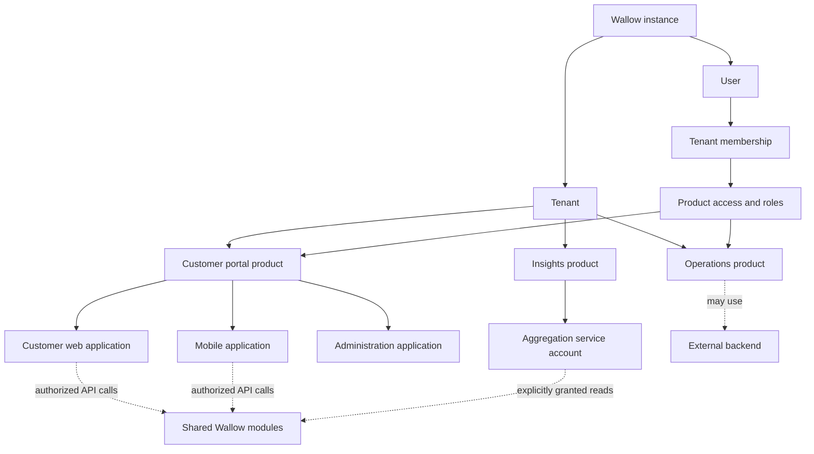

**status: completed**

# Tenant, product and client design

This document completes the design deliverable, not an implementation. The user authorized
documentation and scoping only. No source, schema, generated SDK, seed, infrastructure or test
changes are authorized by this document. The companion [implementation scope](1234-tenant-product-client-scope.md)
defines future work and acceptance criteria.

The hierarchy and terminology below are agreed. Policies labeled **proposed default** are
recommendations for review, not additional decisions attributed to the user. Open decisions are
collected at the end. This design supersedes the organization-based recommendation in the
[initial research](../../agents/research/2026-09-07-multi-tenancy-identity-architecture.md).

## 1. Purpose and agreed boundaries

Someone forks Wallow, operates an instance, and builds several products for their company.
They can implement backend capabilities as Wallow modules, run separate backends, or combine
both. Several products can use the same modules and selected shared datasets. One person can
use several products through one instance identity with separate access assignments.

The agreed hierarchy is **Tenant → Product → Client**. Organizations are not an additional
required layer. A product can have customer web, mobile, administrator web and automation
clients. Application clients act for users; service-account clients act as themselves. Both
are limited by explicit grants. Tenant isolation remains mandatory regardless of deployment size.

A fork is source ownership. An instance is an operated installation. A tenant is a business-data
isolation boundary inside an instance. Separate forks do not share users, keys or data
automatically. One fork can run several instances. **Proposed default:** a new instance starts
with one tenant; the same domain and authorization rules support additional tenants without a
separate single-tenant code path.

The operator remains trusted with the instance and its signing keys. This is logical data
isolation between tenants, not isolation from the operator. Independent operators use separate
instances. Independent tenant identity realms, regional routing and dedicated databases are
separate deployment capabilities, not implied by the hierarchy.

## 2. Domain vocabulary and relationships

| Concept           | Definition and relationship                                                                                      |
| ----------------- | ---------------------------------------------------------------------------------------------------------------- |
| Tenant            | An independently governed company/customer boundary within the instance; owns products and tenant memberships    |
| Product           | A named software offering belonging to exactly one tenant; groups related clients and product access assignments |
| Client            | An OAuth registration belonging to exactly one product for runtime registrations                                 |
| Application       | A client acting on behalf of a signed-in person                                                                  |
| Service account   | A client acting under its own stable non-human identity and explicitly granted authority                         |
| User              | A person identity in this instance, independent of any single tenant or product                                  |
| Tenant membership | Admission and status of a user within a tenant, with tenant administration roles where granted                   |
| Product access    | A user's admission and role assignments for one product, dependent on an active tenant membership                |
| Module            | A backend capability that owns its persistence and contracts; may serve several products                         |
| API resource      | A protected API and its audience; separate from an OAuth client and a product                                    |
| Data grant        | Permission to access a defined dataset/resource and actions across product boundaries inside a tenant            |



The arrows do not grant access. A module is not copied per product, and a product does not need
to correspond to a module, a deployable, an API audience or a database. Reusing module code
across tenants never shares tenant data. The initial model does not register one product or
client across several tenants; separately owned product registrations can use the same software.

## 3. Candidate records and invariants

These are logical records, not prescribed class signatures or final SQL. Identity owns identity,
membership, product registration and client registration. Resource-owning modules own data grants
and fine-grained resource authorization. Shared contracts carry identifiers without sharing ORM entities.

| Record                          | Minimum information and invariant                                                                                        |
| ------------------------------- | ------------------------------------------------------------------------------------------------------------------------ |
| Tenant                          | Stable TenantId, name, lifecycle, admission policy; distinct from any ProductId                                          |
| Product                         | ProductId, TenantId, name, lifecycle; tenant-qualified uniqueness and parent constraint                                  |
| User / ExternalIdentity         | Stable UserId; external issuer/subject identity; global credential lifecycle                                             |
| TenantMembership                | TenantId, UserId, status; unique pair; tenant roles cannot be assigned by ordinary members                               |
| ProductAccess                   | TenantId, ProductId, UserId, status and product roles; valid membership and matching product parent                      |
| RegisteredClient                | Stable client identity, TenantId, ProductId, kind, lifecycle, client authentication method, allowed scopes and audiences |
| Service grant                   | Client principal, permitted operations and resource constraints; no creator-role inheritance                             |
| Role assignment                 | Explicit tenant or product scope; a similarly named role in another scope grants nothing here                            |
| Consent / session / token grant | Bound user or machine subject, client, selected context, granted scopes, audience and revocation lineage                 |
| Data grant                      | TenantId, source ownership, recipient ProductId, dataset/resource selector, actions, lifecycle and authorizing actor     |

Within one module's store, tenant-qualified relationships prevent Tenant A's child referencing
Tenant B's parent. Product-owned relationships additionally qualify ProductId. Cross-module
relationships use validated contracts or local projections rather than foreign keys into another
module's tables. Projections need explicit freshness rules; they cannot silently authorize a
removed membership indefinitely.

IDs are immutable. Moving a product to another tenant or moving a client to another product is
outside the first implementation. Such moves affect credentials, consents, grants, data and audit
history and must not become an ordinary update endpoint.

One service-account client is one principal. Credential rotation preserves the principal and its
audit history. Deleting and recreating an account produces a new identity; reusing its display
name does not restore the old grants. Service accounts receive no password login or user membership.

## 4. Membership, enrollment and administration

**Proposed default:** tenant admission and product access are separate. Joining a tenant does
not automatically grant all products. A product can deliberately enable access for all active
tenant members, but that is an explicit policy with defined default roles. Restrict product roles
to the selected product. Product administrators cannot grant tenant-administrator or platform roles.

An invitation can offer tenant admission plus access to a particular product. Acceptance checks
both current policies; no role grant survives a revoked invitation or inactive parent. Public
customer enrollment, when enabled, grants only the product's customer role and minimum tenant
membership. It does not expose tenant member directories or unrelated products. Default enrollment
should be invite-only until the operator deliberately changes it.

Tenant administrators manage products, memberships and grants within their delegation. Product
administrators manage their product's access and clients. **Proposed default:** administrative
control does not itself grant business-record access. An explicit role or audited operator
procedure is needed. Granting a scope or role is bounded by delegable authority and a platform-owned
permission catalog; an administrator cannot invent privileged scopes or grant platform permissions.

Users can inspect their own memberships and profile without an active product context. Ordinary
product tokens cannot list arbitrary instance users. Tenant-local profile enrichment stays in
that tenant; changing a job title must not alter the user's profile in another tenant.

Product switching obtains a newly validated authorization context. SSO can avoid another password
prompt, but it does not avoid membership, consent or client checks. Sessions in different products
can coexist; a global mutable 'current product' must not silently retarget tokens in another tab.

## 5. Authorization contract

For a user-facing application, authorize an operation only when all conditions hold:

1. The token is a valid access token for the intended API, issuer and lifetime.
2. Tenant, product, client, user membership and product access are active and mutually consistent.
3. The granted token scopes permit the operation and remain within the client's permitted authority.
4. The user's roles/permissions in the applicable context permit the operation.
5. The resource is in the same tenant and its ownership or explicit data grant permits this access.

For a service account, replace user membership and user permissions with its active service
principal and explicit service grants. It still passes client scope, audience, lifecycle and
resource checks. A service account's creator can leave without transferring or deleting its
authority; administrators must still be able to inventory and revoke the account.

```text
User request = valid context AND token scope AND user authority AND resource policy
Machine request = valid context AND token scope AND service authority AND resource policy
```

Scopes and permissions may have different vocabularies, so this is a conjunction of predicates,
not necessarily a string-set intersection. Never union user privileges with client scope grants.

| User                            | Application scopes               | Attempt                                             | Expected                                  |
| ------------------------------- | -------------------------------- | --------------------------------------------------- | ----------------------------------------- |
| Administrator                   | customers.read                   | Delete customer                                     | Deny: application cannot delete           |
| Customer                        | customers.read, customers.delete | Delete another customer's record                    | Deny: user lacks authority                |
| Administrator                   | customers.read, customers.delete | Delete permitted customer in current tenant/product | Allow                                     |
| Administrator in Product A only | Appropriate scope                | Administer Product B                                | Deny without separately granted authority |
| Any user                        | Appropriate scope                | Read another tenant's record                        | Deny                                      |

Allowed scopes are registration policy, requested scopes are the authorization request, and
granted scopes are the token's effective delegation. Issuance cannot exceed allowed scopes,
audiences, consent or applicable authorization policy. Refresh cannot gain authority absent from
the original grant and must re-evaluate reduced permissions. A user receiving broader roles needs
new authorization before receiving broader scopes. OAuth scope rules are described in
[RFC 6749 section 3.3](https://www.rfc-editor.org/rfc/rfc6749.html#section-3.3).

Every product API endpoint declares its scope requirement and actor/resource policy. Authentication
only, profile, discovery and setup routes declare their distinct policy rather than accidentally
falling through the product policy. Checks occur in the API, not just navigation, the SDK or BFF.
Tokens containing many roles must not broaden the selected context. Client kind comes from trusted
registration/token facts, not an `app-`/`sa-` prefix supplied by a caller.

**Proposed default:** product clients have no scope exemptions for first-party provenance or a
globally privileged user. Platform management uses a distinct, explicitly scoped management context.
It can select a tenant/product only through authorized operations. The existing seed-only unbound
platform client needs this deliberate exception to product ownership; do not assign it arbitrary
customer ownership or allow it unrestricted business API calls. Exact representation is an open decision.

## 6. Tokens, app types and external backends

The proposed access-token contract distinguishes subject, client, tenant, acting product, scopes
and API audience. Candidate custom claims are `tenant_id`, `product_id` and an explicit principal
kind; final names are to be reviewed. Standard claims retain their standard meanings. `sub` is
the user for delegated access and the stable service principal for machine access. `client_id`
identifies the OAuth client, while `aud` identifies the receiving API, not the UI or product.
Do not put all membership data into every token. ID tokens are not API access tokens.
[RFC 9068](https://www.rfc-editor.org/rfc/rfc9068.html) provides the JWT access-token profile;
adoption must be verified against OpenIddict rather than claimed from similar claim names.

| Integration                                | Design contract                                                                                                                         |
| ------------------------------------------ | --------------------------------------------------------------------------------------------------------------------------------------- |
| Web application with BFF                   | Confidential application; authorization code with PKCE; backend protects credentials and tokens                                         |
| Native mobile application                  | Public application; system-browser authorization code with PKCE; no embedded shared secret treated as proof of identity                 |
| Service account                            | Confidential client credentials; explicit scopes, audiences and resource grants; no human impersonation                                 |
| External resource server                   | Registers its intended API audience/scopes; validates Wallow access tokens and enforces its own resource rules                          |
| External backend calling Wallow for a user | Uses an appropriately audience-bound delegated token; cannot replace it with broad machine credentials and call that user authorization |

Mobile support is a real expansion of today's confidential-application model. A product may
have both types. Client IDs and embedded mobile secrets cannot prove that a request comes from
an unmodified binary. Scopes constrain issued tokens; user permissions remain necessary.
[RFC 8252](https://www.rfc-editor.org/rfc/rfc8252.html) defines native app requirements and
[RFC 9700](https://www.rfc-editor.org/rfc/rfc9700.html) supplies current OAuth security guidance.

**Proposed default:** audience-specific tokens. A token for an external Orders API must not be
accepted by Wallow's API solely because Wallow issued it. A backend needing two APIs obtains the
appropriate grants/tokens; a generalized token-exchange or on-behalf-of service is deferred unless
a concrete flow requires it. Separately authenticated machine work is allowed, but audit records
must describe its machine authority rather than pretend it retained the initiating user's restrictions.

Wallow cannot enforce authorization inside arbitrary external code. External integrations need
a documented validation contract, supported discovery/JWKS behavior, clear permission ownership,
and an agreed revocation strategy. Protocol compatibility avoids mandatory Wallow libraries; its
custom roles, data and lifecycle semantics still create integration work if an adopter replaces it.
This preserves the identity boundary in [ADR 0001](../../adr/0001-identity-behind-the-oidc-seam.md).

## 7. Data ownership and reusable modules

Classify each resource before deciding its predicates:

| Ownership             | Example                                                      | Access rule                                                            |
| --------------------- | ------------------------------------------------------------ | ---------------------------------------------------------------------- |
| Instance              | Release metadata, global identity credentials                | Dedicated public, self-service or platform policy                      |
| Tenant                | Deliberately shared customer reference directory             | Same tenant plus explicit capability; membership alone is insufficient |
| Product               | Product workflow, product configuration, document collection | Same tenant and owner product, or explicit data grant                  |
| Person within context | Notification, preference, personal upload                    | Owning person plus tenant/product ownership and operation policy       |

A record can be person-specific and product-owned simultaneously. Actor/recipient IDs do not
replace the owning tenant/product. Nullable ProductId must not silently mean unrestricted access;
use explicit domain ownership with constrained persistence. A module may support several ownership
types where that serves its actual domain.

Modules own data and authorization regardless of which product calls them. Reuse means shared
capability, not universal visibility. Notification preferences, branding, push subscriptions,
files, API keys and telemetry all need explicit ownership decisions in the implementation inventory.
For example, a push subscription belongs to its recipient and delivery application context; having
the same UserId in another product does not permit delivery through that subscription.

Use tenant columns and centrally enforced read/write context in the initial shared-database
implementation. Include product predicates wherever product ownership demands them. Global query
filters are useful but can be bypassed and do not replace write authorization. Cover raw SQL, bulk
operations, attached entities, composite relationships and missing context. Database-per-tenant
routing and PostgreSQL RLS are separately scoped capabilities; this design does not certify either.
See the [research isolation comparison](../../agents/research/2026-09-07-multi-tenancy-identity-architecture.md#data-isolation-choices).

## 8. Sharing and aggregation

**Proposed default:** product-owned data is private to its product; cross-product read access
requires a source-authorized grant within the same tenant. Grants identify the dataset or resource,
recipient product, allowed operations and status. A recipient product cannot grant itself access.
Grant management is separately privileged. Client scopes and actor permissions still apply.

Distinguish two aggregation modes:

- **Live delegated view:** the user must satisfy source policies for the selected data. Access
  disappears when the grant or applicable source authority is removed.
- **Materialized report:** an authorized service account reads approved source data and writes a
  new report owned by the Insights product. Access to that report is a separate policy. Approval
  must explicitly permit copying and the report's audience; otherwise materialization could expose
  data to people who cannot read the source.

An Insights token keeps Insights as its acting product; the resource owner remains the source
product. Do not switch ambient context to the source to impersonate a member there. Authorize the
grant, then execute a narrowly scoped source read that preserves caller and owner in audit records.

Start with explicit read grants for one real dataset. A general relationship-policy language,
cross-tenant grants, transitive sharing and arbitrary cross-module queries are deferred. Revocation
stops new reads and scheduled imports. Derived reports retain provenance so retention/deletion
policy can identify affected copies. Already exported copies cannot be recalled. Whether existing
materialized reports must be purged is an open decision, never an implied consequence of grant deletion.

## 9. Module contracts and asynchronous work

Keep modules in-process initially. Durable integration events and module-owned projections support
work that tolerates delayed consistency. Other modules cannot read or write Identity's persistence
or mint identities through private services. External APIs and event contracts must not expose ORM
entities. Extraction later requires network-failure handling and independent operations; it is not free.

There is an existing documentation discrepancy: CONTEXT describes events as the only communication,
while api/CLAUDE permits Shared.Contracts interfaces/commands and constrains handler chains to one
module DbContext. Preserve the actual documented persistence boundary and existing approved contracts;
this tenancy work does not authorize a transport redesign. Reconcile that wording as a separate
documentation decision before extending cross-module contracts.

| Surface              | Required future behavior                                                                                                         |
| -------------------- | -------------------------------------------------------------------------------------------------------------------------------- |
| Request scope        | Validated tenant, acting product, actor kind/ID, client and allowed operation context; immutable during normal execution         |
| Events/outbox        | Explicit owning tenant/product where applicable, event ID and provenance; transactional publication with business state          |
| Jobs and retries     | Fresh scope per execution; tenant-qualified idempotency; distinguish trusted system reactions from revocable user-delegated work |
| Cache and search     | Scope keys/partitions and permission-sensitive results; invalidation when grants or membership change                            |
| Files                | Scope metadata and authorized upload/download/delete, including signed-link lifetime                                             |
| Realtime             | Authorized subscriptions with scope; disconnect or reauthorize when access changes                                               |
| Webhooks and exports | Scoped destinations and payload policy; no unrestricted external access to the internal message bus                              |
| Audit and telemetry  | Record actor, client, tenant, acting product and resource owner without logging credentials; restrict query/export access        |

Tenant and product tombstones prevent delayed/replayed events from recreating deleted data.
Event context identifies ownership; an event is not a reusable bearer token. Sensitive authorization
must have a freshness bound even if projections are eventually consistent.

## 10. Lifecycle and revocation

| Change                    | Required boundary                                                                                                   |
| ------------------------- | ------------------------------------------------------------------------------------------------------------------- |
| Remove product access     | Stop that user's product access and derived authorization; retain other products and the global user                |
| Suspend tenant membership | Stop user access to every product in that tenant; retain memberships in other tenants                               |
| Suspend client            | Stop issuance/refresh and invalidate access under the revocation contract; preserve configuration for reinstatement |
| Rotate service credential | Preserve principal, grants and audit continuity; specify whether existing tokens are also revoked                   |
| Archive product           | Block its clients and product access; retain recoverable data and configuration                                     |
| Delete product            | Revoke clients, assignments and product grants; purge only product-owned data under module lifecycle rules          |
| Delete tenant             | Revoke all descendant authority; purge its scoped data; retain global users with other memberships                  |
| Suspend global user       | Platform-owned operation affecting all of that user's memberships; does not suspend unrelated machines              |

Product deletion must not purge tenant-wide directories or sibling-product records. Tenant deletion
must not delete an instance user simply because that user belonged to it. Archive/reinstate does
not resurrect revoked credentials. Service-account deletion is not user deletion.

**Proposed default:** Wallow-hosted APIs perform an authoritative or coherently invalidated active
grant check on protected requests. New requests after committed revocation must fail; already
authorized in-flight work needs explicit transaction semantics. Self-contained JWT validation at
an external API cannot promise immediate revocation. External consumers either accept a documented
bounded token lifetime or implement a supported live status/introspection mechanism. Exact bounds
and mechanism must be selected before implementation; source-data deletion and other sensitive
operations must not depend on an unspecified eventual update.

## 11. Administration and adopter experience

The intended setup flow creates the instance operator and default tenant. A tenant administrator
creates a product, assigns users, registers its clients, selects allowed capabilities and receives
connection metadata. Application registration distinguishes public mobile clients from confidential
backends; secrets are issued only where appropriate. Service-account registration displays the
machine's own grants and stable identity.

Product screens group clients, member access, authorized module capabilities and sharing grants.
The same user can launch several products without duplicated accounts. The management UI shows
the tenant/product being edited and makes a scope restriction separate from a person's role.
It must not imply that connecting an application automatically imports data or enables every module.

A module installed in a fork supplies available capability. Tenant/product permission grants
decide who may use it. A future module-entitlement switch, if needed, is another prerequisite,
not permission by itself. No plugin marketplace, sandbox for untrusted modules, runtime module
installation or hosted billing system is included. Installed module code is trusted instance code.

## 12. Decision record and remaining choices

| Decision                                                                                           | State                                                           |
| -------------------------------------------------------------------------------------------------- | --------------------------------------------------------------- |
| Tenant → Product → Client; Product name; no mandatory Organization layer                           | Agreed                                                          |
| Application and Service account are client kinds                                                   | Agreed                                                          |
| Users have memberships/product access; application scope and user authority both restrict requests | Agreed                                                          |
| Shared modules, external backends and explicitly authorized aggregation                            | Agreed direction                                                |
| One default tenant; private-by-default product data; explicit product admission                    | Proposed defaults                                               |
| Instance-wide identity directory                                                                   | Working design from the discussion; independent realms deferred |
| Platform management client representation and operator data-access procedure                       | Open; settle before authorization work                          |
| Scope catalog ownership, delegable grants and custom role administration                           | Proposed model above; exact API/editor boundaries open          |
| External API registration and revocation mechanism/latency                                         | Open; settle before token contract work                         |
| Ownership of each existing module record and default enrollment per product                        | Inventory required before schema work                           |
| First shared dataset, report audience and retained-copy deletion policy                            | Open; settle before aggregation work                            |

Choosing these policies does not authorize implementation. The completed deliverable is this
design plus the bounded work packages, dependencies and verification scenarios in the scope.
